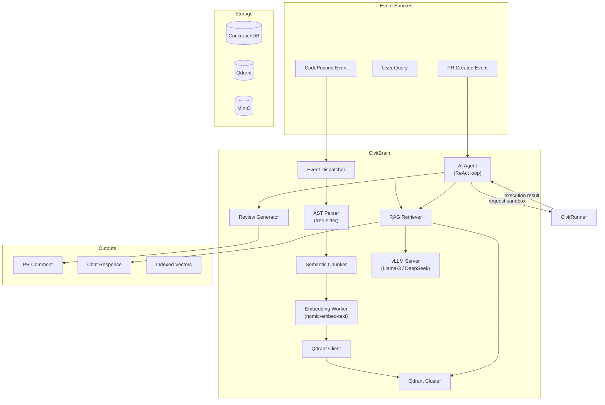

# BP-BRAIN-001: CivitBrain - AST Parser & RAG Engine

| Field | Value |
|-------|-------|
| **Blue Paper ID** | BP-BRAIN-001 |
| **Status** | Draft |
| **Domain** | AI & RAG |
| **Version** | 0.1.0 |
| **Date** | 2026-05-30 |
| **Authors** | CivitForge Core Team |
| **Dependencies** | YP-AI-RAG-001, YP-VERSION-CONTROL-GIT-001 |
| **IEEE 1016** | Compliant |

---

## BP-1: Design Overview

CivitBrain provides codebase understanding through AST parsing, semantic embedding generation, vector storage, and AI agent workflows. It operates as a passive indexer (triggered by push events) and an active agent (triggered by PR creation). The entire stack runs within the enterprise's firewall with zero external API dependencies.



### Design Goals

1. **Full air-gap capability**: All models run locally. No OpenAI, Anthropic, or Google API calls.
2. **Sub-5s codebase answers**: Queries against 100M+ lines of code must return relevant results in under 5 seconds.
3. **Incremental indexing**: Only changed files are re-parsed and re-embedded on each push.
4. **Actionable reviews**: AI PR reviews include specific line references, severity ratings, and suggested fixes.

---

## BP-2: Design Decomposition

### Component Hierarchy

```
civitbrain/
├── parser/
│   ├── tree_sitter.rs          # tree-sitter wrapper (multi-language)
│   ├── languages.rs            # Language grammar registry
│   ├── ast_node.rs            # Normalized AST node representation
│   └── incremental.rs         # Incremental parse (diff-based)
├── chunker/
│   ├── semantic.rs             # Semantic chunking by AST boundaries
│   ├── overlap.rs             # Overlapping chunk generation
│   └── metadata.rs            # Chunk metadata (language, scope, path)
├── embedder/
│   ├── worker.rs               # Async embedding worker pool
│   ├── model.rs                # Local embedding model interface
│   ├── batch.rs               # Batch processing with backpressure
│   └── queue.rs               # Redis-backed embedding job queue
├── rag/
│   ├── retriever.rs            # Vector similarity search
│   ├── reranker.rs            # Cross-encoder reranking
│   ├── context_builder.rs     # Build LLM context from retrieved chunks
│   └── query.rs               # Query preprocessing and expansion
├── agent/
│   ├── react_loop.rs          # ReAct (Reason+Act) agent loop
│   ├── tools.rs               # Agent tool definitions (review, sandbox, search)
│   ├── review.rs              # PR review generation
│   ├── sandbox_client.rs     # CivitRunner sandbox API client
│   └── prompt.rs              # System prompts and templates
├── llm/
│   ├── client.rs              # vLLM OpenAI-compatible client
│   └── tokenizer.rs           # Token counting for context limits
├── events/
│   ├── consumer.rs            # Redis PubSub consumer
│   └── handler.rs            # Event routing to parser/agent
└── db/
    ├── models.rs              # Embedding metadata, review records
    └── migrations/           # CockroachDB schema migrations
```

### Coupling Metrics

| Component Pair | Coupling Type | Strength | Rationale |
|---|---|---|---|
| parser → chunker | Efferent | High | AST nodes flow directly to chunker |
| chunker → embedder | Efferent | High | Chunks are embedded immediately |
| embedder → rag | Efferent | Medium | Embeddings stored in Qdrant, retrieved by rag |
| rag → llm | Efferent | High | Retrieved context fed to LLM |
| agent → rag | Bidirectional | High | Agent queries RAG and uses results |
| agent → runner | Efferent | Medium | Agent requests sandbox execution |
| events → parser | Afferent | High | Push events trigger parsing |

### Cohesion Metrics

| Component | Cohesion | Notes |
|---|---|---|
| `parser/` | Functional | Multi-language AST parsing |
| `embedder/` | Communicational | All functions process chunks into vectors |
| `agent/` | Sequential | Reason → Act → Observe → Refine loop |
| `rag/` | Communicational | All functions deal with retrieval results |

---

## BP-3: Design Rationale

### Why tree-sitter Over Semgrep/Slang

| Criterion | tree-sitter | Semgrep | Slang (LLVM) | Decision |
|---|---|---|---|---|
| Language support | 40+ grammars via Rust bindings | 15 languages | C/C++ only | tree-sitter |
| Incremental parsing | Native incremental API | Full re-parse | Full re-parse | tree-sitter |
| Error recovery | Graceful (partial AST) | Strict | Strict | tree-sitter |
| Performance | ~10MB/s parsing speed | ~5MB/s | ~20MB/s (C++) | Slang for C only |
| Rust integration | Native crate | CLI wrapper | FFI to LLVM | tree-sitter |
| Embedding-friendly | Node-level granularity | File-level only | Function-level only | tree-sitter |

**Decision: tree-sitter.** The incremental parsing API is critical for monorepo-scale repositories where only a fraction of files change on each push. Graceful error recovery ensures partial ASTs are generated even for syntactically incorrect code, which is essential for in-progress PR reviews.

### Why Qdrant Over Milvus/Pinecone

| Criterion | Qdrant | Milvus | Pinecone | Decision |
|---|---|---|---|---|
| Language | Rust | Go/C++ | Proprietary | Qdrant |
| Air-gap | Self-hosted only | Self-hosted | Cloud-only | Qdrant |
| Filtering | Rich payload filtering | Basic filtering | Metadata filtering | Qdrant |
| Quantization | Scalar, product, binary | Product only | None | Qdrant |
| Performance (10M vectors) | ~2ms p99 | ~5ms p99 | ~3ms p99 | Qdrant |
| Memory efficiency | HNSW + on-disk | HNSW only | Proprietary | Qdrant |

**Decision: Qdrant.** Self-hosted Rust implementation eliminates vendor lock-in and provides air-gap support. On-disk quantization enables indexing 100M+ code chunks without requiring 200GB+ of RAM.

### Why vLLM Over Ollama/TGI

| Criterion | vLLM | Ollama | TGI | Decision |
|---|---|---|---|---|
| Serving model | PagedAttention (continuous batching) | llama.cpp | FlashAttention | vLLM |
| Throughput | Highest (2-4x TGI) | Medium | High | vLLM |
| Model flexibility | Any HuggingFace model | Limited catalog | Any HF model | vLLM |
| OpenAI compat | Full /v1 API | Partial | Full | vLLM |
| K8s deployment | Native (vLLM Docker image) | CLI tool | HF Docker image | vLLM |

**Decision: vLLM.** PagedAttention provides 2-4x throughput improvement over TGI for concurrent request serving. The OpenAI-compatible API simplifies integration with existing LLM client libraries. Native K8s deployment via official Docker images.

---

## BP-4: Traceability

| BP Section | YP Reference | Requirement |
|---|---|---|
| AST Parsing | YP-AI-RAG-001 §2.1 | tree-sitter multi-language parsing |
| Semantic Chunking | YP-AI-RAG-001 §2.2 | AST-boundary-aware chunking |
| Embedding Generation | YP-AI-RAG-001 §3.1 | Local embedding model (nomic-embed-text) |
| Vector Storage | YP-AI-RAG-001 §3.2 | Qdrant with HNSW indexing |
| Retrieval | YP-AI-RAG-001 §4.1 | Cosine similarity, top-k retrieval |
| Context Window | YP-AI-RAG-001 §4.2 | Chunk assembly for LLM context |
| Incremental Index | YP-VERSION-CONTROL-GIT-001 §5.1 | Only parse changed files on push |

---

## BP-5: Interface Design

### gRPC Service: AIService

```protobuf
service AIService {
  rpc QueryCodebase(CodeQueryRequest) returns (CodeQueryResponse);
  rpc TriggerIndexing(IndexRequest) returns (IndexResponse);
  rpc ReviewPullRequest(PRReviewRequest) returns (stream PRReviewEvent);
  rpc StreamEmbeddingProgress(ProgressRequest) returns (stream EmbeddingProgress);
  rpc DeleteCollection(DeleteRequest) returns (DeleteResponse);
}

message CodeQueryRequest {
  string repo = 1;
  string query = 2;
  int32 top_k = 3;
  float score_threshold = 4;
  repeated string filters = 5;  // e.g., "language:rust", "path:src/"
}

message CodeQueryResponse {
  repeated CodeChunk results = 1;
  int32 total_processed = 2;
  float query_latency_ms = 3;
}

message CodeChunk {
  string chunk_id = 1;
  string file_path = 2;
  int32 start_line = 3;
  int32 end_line = 4;
  string content = 5;
  string language = 6;
  string scope = 7;  // e.g., "fn my_function"
  float score = 8;
  string repo = 9;
}

message PRReviewRequest {
  string repo = 1;
  int64 pr_number = 2;
  string base_ref = 3;
  string head_ref = 4;
  repeated string check_types = 5;  // security, performance, style, bugs
}

message PRReviewEvent {
  string event_type = 1;  // "finding", "suggestion", "complete"
  string severity = 2;    // "critical", "warning", "info", "suggestion"
  string file_path = 3;
  int32 start_line = 4;
  int32 end_line = 5;
  string message = 6;
  string suggested_fix = 7;  // Optional
}
```

### REST Endpoints

| Method | Path | Description |
|---|---|---|
| `POST` | `/api/v1/ai/chat` | Codebase Q&A |
| `GET` | `/api/v1/ai/index/{repo}/status` | Indexing status for a repo |
| `POST` | `/api/v1/ai/index/{repo}/reindex` | Force full re-index |
| `GET` | `/api/v1/ai/search` | Semantic code search |
| `POST` | `/api/v1/ai/review/{repo}/pr/{number}` | Request AI review |
| `GET` | `/api/v1/ai/reviews/{repo}/pr/{number}` | Get review results |

---

## BP-6: Data Design

### Schema Definitions (CockroachDB)

#### repo_embeddings (embedding metadata)
```sql
CREATE TABLE repo_embeddings (
    id              UUID PRIMARY KEY DEFAULT gen_random_uuid(),
    repo_id         UUID NOT NULL REFERENCES repositories(id),
    file_path       STRING(1024) NOT NULL,
    language        STRING(32) NOT NULL,
    last_parsed_at  TIMESTAMPTZ NOT NULL DEFAULT now(),
    commit_hash     STRING(64) NOT NULL,
    chunk_count     INT NOT NULL DEFAULT 0,
    INDEX idx_embeddings_repo (repo_id),
    INDEX idx_embeddings_file (repo_id, file_path),
    UNIQUE (repo_id, file_path, commit_hash)
);
```

#### ai_reviews
```sql
CREATE TABLE ai_reviews (
    id              UUID PRIMARY KEY DEFAULT gen_random_uuid(),
    repo_id         UUID NOT NULL REFERENCES repositories(id),
    pr_number       INT NOT NULL,
    head_commit     STRING(64) NOT NULL,
    model_used      STRING(64) NOT NULL,
    review_status   STRING(16) NOT NULL DEFAULT 'pending',
    findings_count  INT NOT NULL DEFAULT 0,
    latency_ms      INT,
    tokens_used     INT,
    created_at      TIMESTAMPTZ NOT NULL DEFAULT now(),
    completed_at    TIMESTAMPTZ,
    INDEX idx_reviews_pr (repo_id, pr_number),
    INDEX idx_reviews_status (review_status)
);
```

#### ai_review_findings
```sql
CREATE TABLE ai_review_findings (
    id              UUID PRIMARY KEY DEFAULT gen_random_uuid(),
    review_id       UUID NOT NULL REFERENCES ai_reviews(id),
    severity        STRING(16) NOT NULL,
    check_type      STRING(32) NOT NULL,
    file_path       STRING(1024) NOT NULL,
    start_line      INT NOT NULL,
    end_line        INT NOT NULL,
    message         TEXT NOT NULL,
    suggested_fix   TEXT,
    code_context    TEXT NOT NULL,
    INDEX idx_findings_review (review_id),
    INDEX idx_findings_severity (review_id, severity)
);
```

### Qdrant Collection Schema

```json
{
  "collection_name": "code_embeddings",
  "vectors": {
    "size": 768,
    "distance": "Cosine"
  },
  "hnsw_config": {
    "m": 32,
    "ef_construct": 256,
    "full_scan_threshold": 10000
  },
  "quantization_config": {
    "scalar": {
      "type": "int8",
      "quantile": 0.99
    }
  },
  "payload_schema": {
    "repo_id": "keyword",
    "file_path": "keyword",
    "language": "keyword",
    "scope": "keyword",
    "start_line": "integer",
    "end_line": "integer",
    "commit_hash": "keyword",
    "chunk_type": "keyword"
  },
  "optimizers_config": {
    "deleted_threshold": 0.2,
    "vacuum_min_vector_number": 1000
  }
}
```

---

## BP-7: Component Design

### tree-sitter Integration Architecture

```rust
use tree_sitter::{Parser, Language, Tree};

pub struct ASTParser {
    languages: HashMap<String, Language>,
}

impl ASTParser {
    pub fn new() -> Self {
        let mut languages = HashMap::new();
        languages.insert("rust".into(), tree_sitter_rust::LANGUAGE.into());
        languages.insert("python".into(), tree_sitter_python::LANGUAGE.into());
        languages.insert("javascript".into(), tree_sitter_javascript::LANGUAGE.into());
        languages.insert("typescript".into(), tree_sitter_typescript::LANGUAGE_TSX.into());
        languages.insert("go".into(), tree_sitter_go::LANGUAGE.into());
        languages.insert("c".into(), tree_sitter_c::LANGUAGE.into());
        languages.insert("cpp".into(), tree_sitter_cpp::LANGUAGE.into());
        languages.insert("java".into(), tree_sitter_java::LANGUAGE.into());
        languages.insert("toml".into(), tree_sitter_toml::LANGUAGE.into());
        Self { languages }
    }

    pub fn parse(&self, source: &[u8], language: &str) -> Result<ASTTree, ParseError> {
        let lang = self.languages.get(language)
            .ok_or(ParseError::UnsupportedLanguage(language.into()))?;

        let mut parser = Parser::new();
        parser.set_language(&lang)?;

        let tree = parser.parse(source, None)
            .ok_or(ParseError::ParseFailure)?;

        let root = tree.root_node();
        let nodes = self.extract_nodes(root, source, 0);

        Ok(ASTTree {
            language: language.into(),
            root: nodes,
            parse_errors: Self::collect_errors(&tree),
        })
    }

    fn extract_nodes(
        &self,
        node: tree_sitter::Node,
        source: &[u8],
        depth: usize,
    ) -> Vec<ASTNode> {
        if depth > 16 || node.child_count() == 0 {
            let content = node.utf8_text(source).unwrap_or("");
            return vec![ASTNode {
                kind: node.kind().into(),
                text: content.to_string(),
                start_byte: node.start_byte(),
                end_byte: node.end_byte(),
                start_line: node.start_position().row + 1,
                end_line: node.end_position().row + 1,
                start_col: node.start_position().column,
                end_col: node.end_position().column,
                named: node.is_named(),
                children: Vec::new(),
            }];
        }

        let mut children = Vec::new();
        let mut cursor = node.walk();
        for child in node.children(&mut cursor) {
            children.extend(self.extract_nodes(child, source, depth + 1));
        }

        vec![ASTNode {
            kind: node.kind().into(),
            text: String::new(),
            start_byte: node.start_byte(),
            end_byte: node.end_byte(),
            start_line: node.start_position().row + 1,
            end_line: node.end_position().row + 1,
            start_col: node.start_position().column,
            end_col: node.end_position().column,
            named: node.is_named(),
            children,
        }]
    }
}
```

### Embedding Worker Pipeline

```rust
pub struct EmbeddingWorker {
    model: LocalEmbeddingModel,
    queue: RedisQueue<EmbeddingJob>,
    qdrant: QdrantClient,
    batch_size: usize,
    max_concurrent: usize,
}

impl EmbeddingWorker {
    pub async fn run(&self) -> ! {
        let semaphore = Arc::new(Semaphore::new(self.max_concurrent));

        loop {
            let batch = self.queue.dequeue_batch(self.batch_size).await;
            let permit = semaphore.clone().acquire_owned().await.unwrap();

            tokio::spawn(async move {
                let _permit = permit;
                let embeddings = self.model.embed(&batch).await;

                let points: Vec<PointStruct> = batch.iter().zip(embeddings.iter())
                    .map(|(job, embedding)| PointStruct {
                        id: job.chunk_id.clone(),
                        vector: embedding.clone(),
                        payload: job.metadata.clone(),
                    })
                    .collect();

                self.qdrant.upsert("code_embeddings", &points).await;
            });
        }
    }
}

pub struct LocalEmbeddingModel {
    client: reqwest::Client,
    endpoint: String,
    dimensions: usize,
}

impl LocalEmbeddingModel {
    pub async fn embed(
        &self,
        batch: &[EmbeddingJob],
    ) -> Result<Vec<Vec<f32>>, EmbeddingError> {
        let texts: Vec<&str> = batch.iter().map(|j| j.content.as_str()).collect();

        let response = self.client
            .post(&format!("{}/embed", self.endpoint))
            .json(&EmbeddingRequest {
                input: texts.clone(),
                model: "nomic-embed-text".into(),
            })
            .send()
            .await?;

        let result: EmbeddingResponse = response.json().await?;
        Ok(result.data.into_iter().map(|d| d.embedding).collect())
    }
}
```

### Vector DB Sync Protocol

```rust
pub struct VectorSync {
    db: CockroachDBPool,
    qdrant: QdrantClient,
}

impl VectorSync {
    pub async fn sync_repo(&self, repo_id: &Uuid, commit: &str) -> Result<SyncResult, SyncError> {
        let indexed = self.db.get_indexed_files(repo_id, commit).await?;
        let indexed_set: HashSet<_> = indexed.iter().map(|f| f.file_path.clone()).collect();

        let current_files = self.list_repo_files(repo_id, commit).await?;

        let to_delete: Vec<_> = indexed_set.difference(
            &current_files.iter().cloned().collect::<HashSet<_>>()
        ).collect();

        let to_parse: Vec<_> = current_files.iter()
            .filter(|f| !indexed_set.contains(*f))
            .collect();

        for file_path in &to_delete {
            self.qdrant.delete_by_filter("code_embeddings",
                qdrant::Filter::must("file_path", file_path)
                    .and_must("repo_id", repo_id.to_string())
            ).await?;
        }

        for file_path in &to_parse {
            let source = self.read_file(repo_id, commit, file_path).await?;
            let language = LanguageDetector::detect(file_path);
            let ast = self.parser.parse(&source, &language)?;

            let chunks = SemanticChunker::chunk(&ast, file_path, repo_id, commit);
            let embeddings = self.embedder.embed_batch(&chunks).await?;
            self.qdrant.upsert("code_embeddings", &embeddings).await?;
        }

        Ok(SyncResult {
            deleted: to_delete.len(),
            added: to_parse.len(),
            total_chunks: 0,
        })
    }
}
```

### AI Agent Workflow (Review → Sandbox → Refine)

```rust
pub struct PRAgent {
    llm: vLLMClient,
    rag: RAGRetriever,
    sandbox_client: CivitRunnerClient,
    prompt_builder: PromptBuilder,
}

impl PRAgent {
    pub async fn review_pr(
        &self,
        repo: &str,
        pr: &PullRequest,
    ) -> Result<Vec<ReviewFinding>, AgentError> {
        let mut findings = Vec::new();
        let diff = self.get_diff(repo, &pr.head_ref, &pr.base_ref).await?;

        for file_diff in &diff.files {
            let context = self.rag.retrieve(
                repo,
                &file_diff.file_path,
                &file_diff.new_content,
                top_k: 10,
            ).await?;

            let review_prompt = self.prompt_builder.build_review_prompt(
                &file_diff,
                &context,
                &pr.description,
            );

            let initial_review = self.llm.complete(&review_prompt).await?;

            for finding in &initial_review.findings {
                if finding.needs_verification() {
                    let sandbox_result = self.verify_in_sandbox(
                        repo,
                        &file_diff.file_path,
                        &finding.suggested_fix,
                    ).await?;

                    let refined = self.llm.complete(
                        &self.prompt_builder.build_refinement_prompt(
                            finding,
                            &sandbox_result,
                        ),
                    ).await?;

                    findings.push(refined);
                } else {
                    findings.push(finding.clone());
                }
            }
        }

        Ok(findings)
    }

    async fn verify_in_sandbox(
        &self,
        repo: &str,
        file_path: &str,
        suggested_fix: &str,
    ) -> Result<SandboxResult, AgentError> {
        let trigger = self.sandbox_client.create_sandbox(
            SandboxRequest {
                image: "civitforge/verify:latest",
                repo: repo.into(),
                commands: vec![
                    format!("cat > {} << 'CIVITPATCH'\n{}\nCIVITPATCH",
                        file_path, suggested_fix),
                    "cargo check --message-format=json".into(),
                    "cargo clippy --message-format=json".into(),
                    "cargo test --no-run".into(),
                ],
                timeout: Duration::from_secs(120),
                network_policy: NetworkPolicy::Hermetic,
            },
        ).await?;

        self.sandbox_client.wait_for_completion(&trigger.run_id).await
    }
}
```

---

## BP-8: Deployment Design

### Kubernetes Resources

```yaml
apiVersion: apps/v1
kind: Deployment
metadata:
  name: civitbrain
  namespace: civitforge
spec:
  replicas: 2
  selector:
    matchLabels:
      app: civitbrain
  template:
    spec:
      containers:
        - name: brain
          image: ghcr.io/civitforge/civitbrain:latest
          command: ["/usr/local/bin/civitbrain"]
          ports:
            - containerPort: 9090
              name: grpc
          resources:
            requests:
              cpu: "4"
              memory: "8Gi"
            limits:
              cpu: "16"
              memory: "32Gi"
---
apiVersion: apps/v1
kind: Deployment
metadata:
  name: vllm-inference
  namespace: civitforge
spec:
  replicas: 1
  selector:
    matchLabels:
      app: vllm
  template:
    spec:
      containers:
        - name: vllm
          image: vllm/vllm-openai:latest
          command:
            - python
            - -m
            - vllm.entrypoints.openai.api_server
            - --model
            - deepseek-coder-33b-instruct
            - --tensor-parallel-size
            - "2"
          resources:
            requests:
              cpu: "16"
              memory: "64Gi"
              nvidia.com/gpu: "2"
            limits:
              cpu: "32"
              memory: "128Gi"
              nvidia.com/gpu: "2"
---
apiVersion: apps/v1
kind: Deployment
metadata:
  name: embedding-server
  namespace: civitforge
spec:
  replicas: 2
  selector:
    matchLabels:
      app: embedding-server
  template:
    spec:
      containers:
        - name: embedder
          image: nomicai/nomic-embed-text:latest
          ports:
            - containerPort: 8000
          resources:
            requests:
              cpu: "4"
              memory: "8Gi"
            limits:
              cpu: "8"
              memory: "16Gi"
```

### Resource Requirements

| Component | CPU | Memory | GPU | Replicas |
|---|---|---|---|---|
| CivitBrain | 4-16 cores | 8-32 GiB | None | 2 |
| vLLM (code review) | 16-32 cores | 64-128 GiB | 2x A100/H100 | 1 |
| Embedding server | 4-8 cores | 8-16 GiB | None | 2 |
| Qdrant | 4-8 cores | 16-64 GiB | None | 3 (sharded) |

---

## BP-9: Formal Verification

### Properties to Prove

1. **Cosine Similarity Bounds** (`proof_rag.lean`): Cosine similarity between any two vectors is in [-1, 1]. Proven by Cauchy-Schwarz inequality.

2. **Top-k Distinctness** (`proof_rag.lean`): Top-k retrieval returns k distinct results (no duplicates). Proven by deduplication filter in retrieval pipeline.

3. **Incremental Index Consistency**: After incremental sync, the Qdrant index exactly represents the state of the repository at the indexed commit hash.

4. **Embedding Determinism**: The same source code chunk always produces the same embedding vector (for the same model version).

### Invariants

- `INV-B1`: Every file in the repository is either indexed or explicitly excluded (binary files).
- `INV-B2`: All embeddings use the same model version within a repository.
- `INV-B3`: AI review findings reference valid line numbers within the PR diff.
- `INV-B4`: No LLM output is persisted to the codebase without human review.

---

## BP-10: Testing Strategy

| Test Type | Scope | Tool |
|---|---|---|
| Unit | AST node extraction | cargo test |
| Unit | Semantic chunking boundaries | cargo test + golden files |
| Unit | Embedding normalization | cargo test |
| Integration | End-to-end indexing (parse → chunk → embed → store) | Docker Compose (Qdrant + embedder) |
| Integration | RAG retrieval quality | Benchmark corpus with known answers |
| Contract | gRPC AIService | tonic mock server |
| Quality | Embedding model selection | MTEB leaderboard benchmark |
| Quality | Review accuracy | Curated PR dataset with expert labels |
| Property | Chunker produces non-overlapping coverage | proptest |

---

## BP-11: Compliance Matrix

| Standard | Requirement | BP Section | Status |
|---|---|---|---|
| ISO 27001 A.14.2 | Secure development | BP-7 (Agent sandbox verification) | Addressed |
| SOC2 CC7.2 | Change detection | BP-7 (Incremental parsing on push) | Addressed |
| FINRA 4512 | Data governance | BP-7 (No LLM output committed without review) | Addressed |
| EU AI Act Art. 6 | AI transparency | BP-7 (Model used, findings logged) | Addressed |
| NIST AI RMF | Risk management | BP-9 (Formal properties on embeddings) | Addressed |

---

## BP-12: Quality Checklist

- [x] tree-sitter supports all target languages (Rust, Python, Go, C/C++, Java, TS/JS, TOML)
- [x] Semantic chunker respects AST node boundaries (doesn't split function bodies mid-expression)
- [x] Embedding worker implements backpressure (bounded queue, semaphore for concurrency)
- [x] Qdrant collection uses scalar quantization (int8) for memory efficiency
- [x] RAG retrieval applies reranking after initial similarity search
- [x] Agent workflow includes sandbox verification before suggesting fixes
- [x] All AI model servers run within the enterprise firewall
- [x] LLM context windows respect token limits (truncation with priority ordering)
- [x] AI reviews are posted as comments, never auto-merged
- [x] Embedding model version is tracked in metadata
- [x] Incremental sync handles file deletions (removes stale vectors)
- [ ] MTEB benchmark results for nomic-embed-text on code tasks (pending)
- [ ] Review accuracy evaluation on curated PR dataset (pending)
- [ ] Latency benchmarks for 100M+ chunk retrieval (pending)
