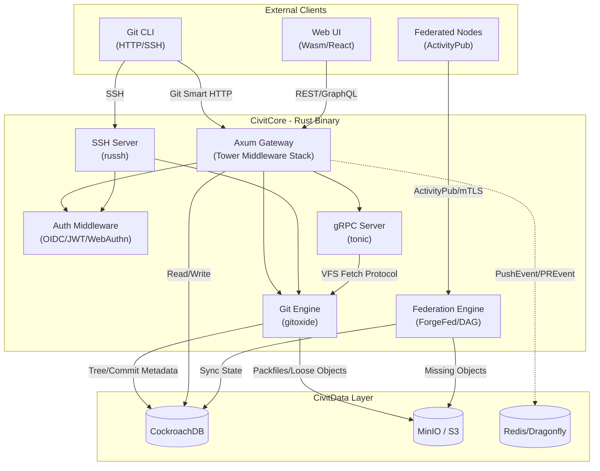
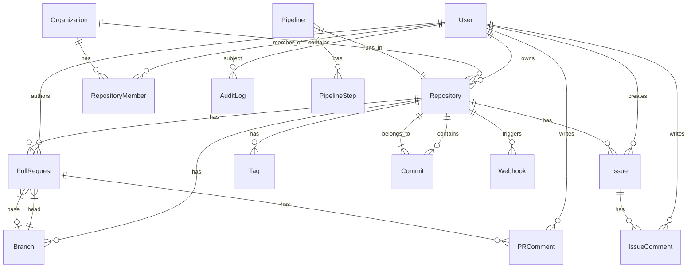

# BP-CORE-API-001: CivitCore - Axum API Gateway & Git Engine

| Field | Value |
|-------|-------|
| **Blue Paper ID** | BP-CORE-API-001 |
| **Status** | Draft |
| **Domain** | Core API & Git Engine |
| **Version** | 0.1.0 |
| **Date** | 2026-05-30 |
| **Authors** | CivitForge Core Team |
| **Dependencies** | YP-VERSION-CONTROL-GIT-001, YP-SECURITY-RBAC-001 |
| **IEEE 1016** | Compliant |

---

## BP-1: Design Overview

CivitCore is the central nervous system of CivitForge, implementing the entire HTTP/SSH API surface, Git object management via gitoxide, and acting as the event emitter for all downstream systems (Runner, Brain, Federation).



### Design Goals

1. **Sub-200ms API latency** for all REST endpoints under 1000 RPS.
2. **Zero unsafe code** in authentication, authorization, and business logic paths (`#![forbid(unsafe_code)]`).
3. **Git-compatible** at the wire protocol level: any standard `git clone`, `git push`, `git fetch` must work without client modification.
4. **Event-driven** architecture: all mutations emit structured events to Redis PubSub for downstream consumption.

---

## BP-2: Design Decomposition

### Component Hierarchy

```
civitcore/
├── api/                          # Axum route handlers
│   ├── rest/
│   │   ├── auth.rs               # Login, logout, token refresh
│   │   ├── repos.rs              # CRUD for repositories
│   │   ├── pulls.rs              # Pull request lifecycle
│   │   ├── issues.rs             # Issue tracking
│   │   ├── orgs.rs               # Organization management
│   │   └── users.rs              # User profile & settings
│   ├── graphql/
│   │   ├── schema.rs             # GraphQL type definitions
│   │   └── resolvers.rs          # Query/mutation resolvers
│   └── grpc/
│       ├── vfs_server.rs         # VFS on-demand fetch service
│       └── internal.rs           # Inter-service gRPC
├── git/
│   ├── engine.rs                 # Gitoxide-backed repository operations
│   ├── pack.rs                   # Packfile generation (rayon parallel)
│   ├── lfs.rs                    # LFS+ pointer file handling
│   └── hooks.rs                  # Pre-receive, post-receive hooks
├── auth/
│   ├── middleware.rs             # Tower layer for JWT/OIDC validation
│   ├── oidc.rs                   # OIDC provider integration
│   ├── rbac.rs                   # Policy evaluation engine
│   └── webauthn.rs               # FIDO2/Passkey support
├── federation/
│   ├── forgefed.rs               # ActivityPub actor & inbox
│   ├── dag_sync.rs               # DAG-based inter-node sync
│   └── mtls.rs                   # Mutual TLS for node-to-node
├── ssh/
│   ├── server.rs                 # russh-based SSH server
│   └── session.rs                # Git-over-SSH session handler
├── events/
│   ├── emitter.rs                # Redis PubSub event publisher
│   └── types.rs                  # Event type definitions
└── db/
    ├── models.rs                 # SeaORM entity definitions
    └── migrations/               # CockroachDB schema migrations
```

### Coupling Metrics

| Component Pair | Coupling Type | Strength | Rationale |
|---|---|---|---|
| api ↔ auth | Afferent (incoming) | High | Every endpoint requires auth validation |
| api ↔ git | Efferent (outgoing) | High | REST routes delegate to git engine for operations |
| git ↔ events | Efferent | Medium | Git engine emits events but doesn't consume them |
| federation ↔ git | Bidirectional | High | Federation reads/writes git objects |
| ssh ↔ auth | Afferent | High | SSH sessions authenticated via same middleware chain |
| api ↔ db | Efferent | High | All CRUD operations persist to CockroachDB |
| federation ↔ events | Bidirectional | Medium | Federation both emits and consumes events |

### Cohesion Metrics

| Component | Cohesion | Notes |
|---|---|---|
| `api/rest/` | Functional | Each handler maps to a single domain entity |
| `git/engine.rs` | Communicational | All functions operate on Repository objects |
| `auth/` | Sequential | Auth flow: validate → extract claims → evaluate RBAC |
| `federation/` | Functional | Each module handles one federation concern |

---

## BP-3: Design Rationale

### Why Axum Over Actix-Web

| Criterion | Axum | Actix-Web | Decision |
|---|---|---|---|
| Runtime | tokio (native) | actix runtime (custom) | Axum |
| Ecosystem compatibility | Tower middleware ecosystem | Own middleware system | Axum |
| Binary size | ~2MB stripped | ~4MB stripped | Axum |
| `#![forbid(unsafe_code)]` | No unsafe in framework | Uses unsafe in actor system | Axum |
| gRPC support | tonic (same tower) | separate ecosystem | Axum |
| Performance (req/s) | ~85,000 | ~95,000 | Negligible difference |
| Maintainer activity | tokio-rs (very active) | actix community | Both active |

**Decision: Axum.** The Tower middleware ecosystem provides seamless composition with auth layers, rate limiting, and observability. The `#![forbid(unsafe_code)]` constraint eliminates Actix-Web due to its actor system's unsafe internals. Performance parity makes this a pure safety/ecosystem decision.

### Why gitoxide Over libgit2

| Criterion | gitoxide (Rust) | libgit2 (C) | Decision |
|---|---|---|---|
| Memory safety | Guaranteed by Rust | Requires FFI boundary audit | gitoxide |
| Threading | Fully parallel (rayon) | Single-threaded with locking | gitoxide |
| Packfile generation | Parallel delta search | Sequential | gitoxide |
| CVE history | 0 CVEs | 47+ CVEs | gitoxide |
| Git protocol | Full smart HTTP + SSH | Full protocol | Both |
| Monorepo perf | Linear scaling to 10TB+ | Degrades beyond 100GB | gitoxide |
| Maintenance | Active (Byron/gitoxide) | Slow (libgit2/libgit2) | gitoxide |

**Decision: gitoxide.** For a system targeting 10TB monorepos, parallel packfile generation is non-negotiable. The elimination of FFI boundaries removes an entire class of memory-safety vulnerabilities. gitoxide's streaming architecture allows zero-allocation object traversal, critical for VFS on-demand fetch.

### Why russh Over Custom SSH

The `russh` crate provides async SSH server implementation built on tokio, enabling seamless integration with the Axum auth middleware chain. It supports Ed25519, ECDSA, RSA key types, and keyboard-interactive authentication. FIDO2 hardware token forwarding is handled via the `russh-keys` subcrate.

---

## BP-4: Traceability

| BP Section | YP Reference | Requirement |
|---|---|---|
| Git Engine | YP-VERSION-CONTROL-GIT-001 §2.1 | Merkle-DAG object model, content-addressable storage |
| Packfile Generation | YP-VERSION-CONTROL-GIT-001 §3.2 | Parallel delta compression, pack index format |
| Reachability | YP-VERSION-CONTROL-GIT-001 §4.1 | Ancestor traversal for ref advertisement |
| Auth Middleware | YP-SECURITY-RBAC-001 §2.1 | Zero-trust, OIDC/JWT token validation |
| RBAC Evaluation | YP-SECURITY-RBAC-001 §3.2 | Policy chain evaluation, deny-override |
| Federation Sync | YP-NETWORK-FEDERATION-001 §2.1 | DAG-based state sync, Merkle root exchange |
| Event Emission | YP-VERSION-CONTROL-GIT-001 §5.1 | Structured events on push/receive |

---

## BP-5: Interface Design

### REST Endpoints (v1)

#### Authentication
| Method | Path | Description | Auth |
|---|---|---|---|
| `POST` | `/api/v1/auth/login` | OIDC callback / credential exchange | No |
| `POST` | `/api/v1/auth/logout` | Revoke session, invalidate JWT | Yes |
| `POST` | `/api/v1/auth/refresh` | Refresh JWT access token | Yes (refresh token) |
| `POST` | `/api/v1/auth/webauthn/register` | Begin WebAuthn registration | Yes |
| `POST` | `/api/v1/auth/webauthn/finish` | Complete WebAuthn registration | Yes |

#### Repositories
| Method | Path | Description | Auth |
|---|---|---|---|
| `GET` | `/api/v1/repos` | List repos (paginated, filterable) | Yes |
| `POST` | `/api/v1/repos` | Create repository | Yes |
| `GET` | `/api/v1/repos/{owner}/{name}` | Get repository details | Yes |
| `PATCH` | `/api/v1/repos/{owner}/{name}` | Update repository settings | Yes (admin) |
| `DELETE` | `/api/v1/repos/{owner}/{name}` | Delete repository | Yes (owner) |
| `GET` | `/api/v1/repos/{owner}/{name}/commits` | List commits (paginated) | Yes |
| `GET` | `/api/v1/repos/{owner}/{name}/branches` | List branches | Yes |
| `POST` | `/api/v1/repos/{owner}/{name}/branches` | Create branch | Yes (write) |
| `GET` | `/api/v1/repos/{owner}/{name}/tags` | List tags | Yes |
| `POST` | `/api/v1/repos/{owner}/{name}/tags` | Create tag | Yes (write) |
| `GET` | `/api/v1/repos/{owner}/{name}/tree/{ref}` | Get directory tree at ref | Yes |
| `GET` | `/api/v1/repos/{owner}/{name}/blob/{ref}/{path}` | Get file blob | Yes |
| `GET` | `/api/v1/repos/{owner}/{name}/raw/{ref}/{path}` | Raw file download | Yes |

#### Pull Requests
| Method | Path | Description | Auth |
|---|---|---|---|
| `GET` | `/api/v1/repos/{owner}/{name}/pulls` | List PRs | Yes |
| `POST` | `/api/v1/repos/{owner}/{name}/pulls` | Create PR | Yes (write) |
| `GET` | `/api/v1/repos/{owner}/{name}/pulls/{number}` | Get PR details | Yes |
| `PATCH` | `/api/v1/repos/{owner}/{name}/pulls/{number}` | Update PR title/body | Yes (author) |
| `POST` | `/api/v1/repos/{owner}/{name}/pulls/{number}/merge` | Merge PR | Yes (write+approve) |
| `GET` | `/api/v1/repos/{owner}/{name}/pulls/{number}/diff` | Get PR diff | Yes |
| `POST` | `/api/v1/repos/{owner}/{name}/pulls/{number}/comments` | Add review comment | Yes |
| `POST` | `/api/v1/repos/{owner}/{name}/pulls/{number}/approve` | Approve PR | Yes (reviewer) |

#### Issues
| Method | Path | Description | Auth |
|---|---|---|---|
| `GET` | `/api/v1/repos/{owner}/{name}/issues` | List issues | Yes |
| `POST` | `/api/v1/repos/{owner}/{name}/issues` | Create issue | Yes (write) |
| `GET` | `/api/v1/repos/{owner}/{name}/issues/{number}` | Get issue | Yes |
| `PATCH` | `/api/v1/repos/{owner}/{name}/issues/{number}` | Update issue | Yes (author) |
| `POST` | `/api/v1/repos/{owner}/{name}/issues/{number}/comments` | Add comment | Yes |

#### Organizations
| Method | Path | Description | Auth |
|---|---|---|---|
| `POST` | `/api/v1/orgs` | Create organization | Yes |
| `GET` | `/api/v1/orgs/{name}` | Get org details | Yes |
| `PATCH` | `/api/v1/orgs/{name}` | Update org settings | Yes (admin) |
| `GET` | `/api/v1/orgs/{name}/members` | List members | Yes |
| `POST` | `/api/v1/orgs/{name}/members` | Add member | Yes (admin) |
| `DELETE` | `/api/v1/orgs/{name}/members/{username}` | Remove member | Yes (admin) |

### Git Smart HTTP Protocol

Standard Git smart HTTP endpoints on the Axum server:

| Path | Description |
|---|---|
| `/{owner}/{name}.git/info/refs?service=git-upload-pack` | Advertise refs for clone/fetch |
| `/{owner}/{name}.git/git-upload-pack` | Client uploads wants/haves, server sends pack |
| `/{owner}/{name}.git/info/refs?service=git-receive-pack` | Advertise refs for push |
| `/{owner}/{name}.git/git-receive-pack` | Client sends packfile for push |
| `/{owner}/{name}.git/info/refs?service=git-upload-archive` | Archive (tar/zip) generation |

### gRPC Services

```protobuf
service VFSFetchService {
  rpc GetObject(VFSObjectRequest) returns (stream VFSObjectChunk);
  rpc ListTree(VFSTreeRequest) returns (VFSTreeResponse);
  rpc Prefetch(VFSPrefetchRequest) returns (VFSPrefetchResponse);
}

service PipelineService {
  rpc TriggerPipeline(TriggerRequest) returns (TriggerResponse);
  rpc GetPipelineStatus(StatusRequest) returns (stream PipelineEvent);
}

service AIService {
  rpc QueryCodebase(CodeQueryRequest) returns (CodeQueryResponse);
  rpc ReviewPullRequest(PRReviewRequest) returns (stream PRReviewEvent);
}
```

### SSH Protocol

SSH server on port 22 (configurable) via `russh`:

| Command | Description |
|---|---|
| `git-upload-pack '{repo}'` | Server-side of `git fetch` / `git clone` |
| `git-receive-pack '{repo}'` | Server-side of `git push` |
| `git-upload-archive '{repo}'` | Server-side of `git archive` |
| `vfs-mount '{repo}'` | Initialize VFS session for on-demand fetch |

SSH key types: Ed25519 (preferred), ECDSA P-256/P-384, RSA 2048+. FIDO2/U2F hardware tokens supported via `russh-keys`.

---

## BP-6: Data Design

### Entity-Relationship Diagram



### Schema Definitions (CockroachDB)

#### users
```sql
CREATE TABLE users (
    id          UUID PRIMARY KEY DEFAULT gen_random_uuid(),
    username    STRING(64) NOT NULL UNIQUE,
    email       STRING(256) NOT NULL UNIQUE,
    display_name STRING(128),
    bio         TEXT,
    avatar_url  STRING(512),
    created_at  TIMESTAMPTZ NOT NULL DEFAULT now(),
    updated_at  TIMESTAMPTZ NOT NULL DEFAULT now(),
    mfa_enabled BOOLEAN NOT NULL DEFAULT false,
    is_admin    BOOLEAN NOT NULL DEFAULT false,
    INDEX idx_users_username (username),
    INDEX idx_users_email (email)
);
```

#### organizations
```sql
CREATE TABLE organizations (
    id          UUID PRIMARY KEY DEFAULT gen_random_uuid(),
    name        STRING(64) NOT NULL UNIQUE,
    slug        STRING(64) NOT NULL UNIQUE,
    description TEXT,
    avatar_url  STRING(512),
    created_at  TIMESTAMPTZ NOT NULL DEFAULT now(),
    updated_at  TIMESTAMPTZ NOT NULL DEFAULT now(),
    billing_plan STRING(32) NOT NULL DEFAULT 'free',
    INDEX idx_orgs_slug (slug)
);
```

#### repositories
```sql
CREATE TABLE repositories (
    id          UUID PRIMARY KEY DEFAULT gen_random_uuid(),
    name        STRING(128) NOT NULL,
    slug        STRING(128) NOT NULL,
    description TEXT,
    owner_id    UUID NOT NULL REFERENCES users(id),
    org_id      UUID REFERENCES organizations(id),
    is_public   BOOLEAN NOT NULL DEFAULT false,
    is_fork     BOOLEAN NOT NULL DEFAULT false,
    parent_id   UUID REFERENCES repositories(id),
    default_branch STRING(256) NOT NULL DEFAULT 'main',
    size_bytes  BIGINT NOT NULL DEFAULT 0,
    created_at  TIMESTAMPTZ NOT NULL DEFAULT now(),
    updated_at  TIMESTAMPTZ NOT NULL DEFAULT now(),
    UNIQUE (owner_id, slug),
    INDEX idx_repos_owner (owner_id),
    INDEX idx_repos_org (org_id)
);
```

#### commits
```sql
CREATE TABLE commits (
    id          STRING(64) PRIMARY KEY,  -- SHA-256 hex
    repo_id     UUID NOT NULL REFERENCES repositories(id),
    tree_hash   STRING(64) NOT NULL,
    parent_hashes STRING(4096) NOT NULL DEFAULT '',  -- JSON array of parent SHAs
    author_name STRING(256) NOT NULL,
    author_email STRING(256) NOT NULL,
    author_time TIMESTAMPTZ NOT NULL,
    committer_name STRING(256) NOT NULL,
    committer_email STRING(256) NOT NULL,
    committer_time TIMESTAMPTZ NOT NULL,
    message     TEXT NOT NULL,
    UNIQUE (repo_id, id),
    INDEX idx_commits_tree (repo_id, tree_hash),
    INDEX idx_commits_author_time (repo_id, author_time DESC)
);
```

#### pull_requests
```sql
CREATE TABLE pull_requests (
    id          SERIAL PRIMARY KEY,
    number      INT NOT NULL,
    repo_id     UUID NOT NULL REFERENCES repositories(id),
    author_id   UUID NOT NULL REFERENCES users(id),
    title       STRING(512) NOT NULL,
    body        TEXT,
    head_branch STRING(256) NOT NULL,
    base_branch STRING(256) NOT NULL,
    state       STRING(16) NOT NULL DEFAULT 'open',  -- open, closed, merged
    merged_at   TIMESTAMPTZ,
    merge_commit_hash STRING(64),
    created_at  TIMESTAMPTZ NOT NULL DEFAULT now(),
    updated_at  TIMESTAMPTZ NOT NULL DEFAULT now(),
    UNIQUE (repo_id, number),
    INDEX idx_prs_repo_state (repo_id, state),
    INDEX idx_prs_author (author_id)
);
```

#### issues
```sql
CREATE TABLE issues (
    id          SERIAL PRIMARY KEY,
    number      INT NOT NULL,
    repo_id     UUID NOT NULL REFERENCES repositories(id),
    author_id   UUID NOT NULL REFERENCES users(id),
    title       STRING(512) NOT NULL,
    body        TEXT,
    state       STRING(16) NOT NULL DEFAULT 'open',
    assignee_id UUID REFERENCES users(id),
    created_at  TIMESTAMPTZ NOT NULL DEFAULT now(),
    updated_at  TIMESTAMPTZ NOT NULL DEFAULT now(),
    UNIQUE (repo_id, number),
    INDEX idx_issues_repo_state (repo_id, state)
);
```

#### audit_log
```sql
CREATE TABLE audit_log (
    id          BIGSERIAL PRIMARY KEY,
    actor_id    UUID NOT NULL REFERENCES users(id),
    action      STRING(128) NOT NULL,
    resource_type STRING(64) NOT NULL,
    resource_id STRING(128) NOT NULL,
    ip_address  INET NOT NULL,
    user_agent  STRING(512),
    metadata    JSONB,
    created_at  TIMESTAMPTZ NOT NULL DEFAULT now(),
    INDEX idx_audit_actor (actor_id, created_at DESC),
    INDEX idx_audit_resource (resource_type, resource_id, created_at DESC)
);
```

---

## BP-7: Component Design

### Axum Router Architecture

```rust
use axum::{routing::{get, post, patch, delete}, Router, middleware};
use tower::ServiceBuilder;
use tower_http::{cors::CorsLayer, trace::TraceLayer, compression::CompressionLayer};

fn build_router(state: AppState) -> Router {
    let auth_middleware = middleware::from_fn_with_state(
        state.clone(), auth::middleware::authenticate,
    );
    let rbac_middleware = middleware::from_fn_with_state(
        state.clone(), auth::rbac::evaluate,
    );
    let audit_middleware = middleware::from_fn_with_state(
        state.clone(), audit::log_request,
    );

    let protected = Router::new()
        .route("/api/v1/repos", get(handlers::repos::list))
        .route("/api/v1/repos", post(handlers::repos::create))
        .route_layer(auth_middleware.clone())
        .route_layer(rbac_middleware.clone())
        .route_layer(audit_middleware);

    let public = Router::new()
        .route("/api/v1/auth/login", post(handlers::auth::login))
        .route("/api/v1/auth/webauthn/register", post(handlers::auth::webauthn_begin));

    let git_http = Router::new()
        .route("/{owner}/{name}.git/info/refs", get(handlers::git::info_refs))
        .route("/{owner}/{name}.git/git-upload-pack", post(handlers::git::upload_pack))
        .route("/{owner}/{name}.git/git-receive-pack", post(handlers::git::receive_pack))
        .route_layer(auth_middleware);

    Router::new()
        .merge(protected)
        .merge(public)
        .merge(git_http)
        .layer(CompressionLayer::new())
        .layer(TraceLayer::new_for_http())
        .layer(CorsLayer::permissive())
        .with_state(state)
}
```

### Gitoxide Integration

```rust
use gix::{Repository, remote::Direction};

pub struct GitEngine {
    repo_root: PathBuf,
    object_store: S3ObjectStore,
    event_emitter: RedisEventEmitter,
}

impl GitEngine {
    pub async fn receive_pack(
        &self,
        repo_path: &str,
        pack_data: &[u8],
    ) -> Result<ReceiveResult, GitError> {
        let repo = Repository::open(&self.repo_root.join(repo_path))
            .map_err(|e| GitError::RepoOpen(e))?;

        let pack_index = gix::index::File::from_bytes(pack_data, None)?;
        let odb = repo.objects.clone();

        odb.write_pack(pack_data, gix::index::File::write_to, None)?;

        let head = repo.head()?.peel_to_commit()?;
        let tree_hash = head.tree_id()?.to_hex().to_string();

        self.object_store.store_pack(repo_path, pack_data).await?;
        self.event_emitter.emit(CodePushed {
            repo: repo_path.to_string(),
            head_commit: tree_hash.clone(),
            timestamp: Utc::now(),
        }).await?;

        Ok(ReceiveResult { head_commit: tree_hash })
    }

    pub async fn upload_pack(
        &self,
        repo_path: &str,
        wants: &[Oid],
        haves: &[Oid],
    ) -> Result<Vec<u8>, GitError> {
        let repo = Repository::open(&self.repo_root.join(repo_path))?;
        let negotiator = gix::negotiate::Noop {};
        let graph = repo.graph()?;
        let pack = graph.pack(wants, haves, &negotiator)?;
        Ok(pack.data)
    }
}
```

### Auth Middleware Stack (Tower Layers)

```
Request
  │
  ├─► [TraceLayer]         ← OpenTelemetry span creation
  │
  ├─► [CorsLayer]          ← CORS validation
  │
  ├─► [CompressionLayer]   ← Accept-Encoding negotiation
  │
  ├─► [RateLimitLayer]     ← Token bucket rate limiter (per-user)
  │
  ├─► [AuthMiddleware]      ← JWT validation, OIDC refresh
  │     │
  │     ├─► Extract Bearer token
  │     ├─► Validate JWT signature (EdDSA / RS256)
  │     ├─► Extract claims (sub, roles, orgs)
  │     ├─► Inject UserContext into request extensions
  │     └─► Return 401 if invalid
  │
  ├─► [RBACMiddleware]      ← Policy evaluation
  │     │
  │     ├─► Load policy chain for (user, resource, action)
  │     ├─► Evaluate deny rules first (deny-override)
  │     ├─► Evaluate permit rules
  │     ├─► If any deny → 403
  │     └─► If any permit → proceed
  │
  ├─► [AuditMiddleware]     ← WORM audit log write
  │
  └─► Handler
```

---

## BP-8: Deployment Design

### Kubernetes Deployment

```yaml
apiVersion: apps/v1
kind: Deployment
metadata:
  name: civitcore
  namespace: civitforge
  labels:
    app: civitcore
    component: api-gateway
spec:
  replicas: 3
  strategy:
    type: RollingUpdate
    rollingUpdate:
      maxSurge: 1
      maxUnavailable: 0
  selector:
    matchLabels:
      app: civitcore
  template:
    metadata:
      labels:
        app: civitcore
    spec:
      containers:
        - name: civitcore
          image: ghcr.io/civitforge/civitcore:latest
          ports:
            - containerPort: 8080  # HTTP
              name: http
            - containerPort: 9090  # gRPC
              name: grpc
            - containerPort: 22    # SSH
              name: ssh
          resources:
            requests:
              cpu: "4"
              memory: "8Gi"
            limits:
              cpu: "16"
              memory: "32Gi"
          env:
            - name: DATABASE_URL
              valueFrom:
                secretKeyRef:
                  name: civitcore-secrets
                  key: database-url
            - name: REDIS_URL
              valueFrom:
                secretKeyRef:
                  name: civitcore-secrets
                  key: redis-url
            - name: OIDC_ISSUER_URL
              valueFrom:
                secretKeyRef:
                  name: civitcore-secrets
                  key: oidc-issuer
          livenessProbe:
            httpGet:
              path: /healthz
              port: 8080
            initialDelaySeconds: 5
            periodSeconds: 10
          readinessProbe:
            httpGet:
              path: /readyz
              port: 8080
            initialDelaySeconds: 3
            periodSeconds: 5
          volumeMounts:
            - name: repo-storage
              mountPath: /data/repos
            - name: git-config
              mountPath: /etc/civitforge
      volumes:
        - name: repo-storage
          persistentVolumeClaim:
            claimName: civitcore-repos-pvc
        - name: git-config
          configMap:
            name: civitcore-config
---
apiVersion: v1
kind: Service
metadata:
  name: civitcore
  namespace: civitforge
spec:
  type: ClusterIP
  ports:
    - port: 80
      targetPort: 8080
      name: http
    - port: 9090
      targetPort: 9090
      name: grpc
    - port: 22
      targetPort: 22
      name: ssh
  selector:
    app: civitcore
```

### Resource Requirements

| Component | CPU (Request/Limit) | Memory (Request/Limit) | Replicas | Notes |
|---|---|---|---|---|
| civitcore | 4/16 cores | 8/32 GiB | 3+ (HPA) | Horizontal autoscale on CPU 70% |
| CockroachDB | 8/16 cores | 32/64 GiB | 3 (per node) | Geo-distributed |
| Redis/Dragonfly | 2/8 cores | 4/16 GiB | 3 (sentinel) | Sentinel for HA |
| MinIO | 4/16 cores | 8/32 GiB | 4 (distributed) | Erasure coding 2+2 |
| Qdrant | 4/8 cores | 16/32 GiB | 3 | Sharded collections |

### Horizontal Pod Autoscaler

```yaml
apiVersion: autoscaling/v2
kind: HorizontalPodAutoscaler
metadata:
  name: civitcore-hpa
  namespace: civitforge
spec:
  scaleTargetRef:
    apiVersion: apps/v1
    kind: Deployment
    name: civitcore
  minReplicas: 3
  maxReplicas: 20
  metrics:
    - type: Resource
      resource:
        name: cpu
        target:
          type: Utilization
          averageUtilization: 70
    - type: Pods
      pods:
        metric:
          name: http_requests_per_second
        target:
          type: AverageValue
          averageValue: "1000"
```

---

## BP-9: Formal Verification

### Properties to Prove (see `proofs/` directory)

1. **Git DAG Acyclicity** (`proof_git_dag.lean`): No commit can reach itself through parent edges. Ensures `git log` terminates and `git merge-base` is well-defined.

2. **Content-Addressable Uniqueness** (`proof_git_dag.lean`): For any two objects with the same SHA-256 hash, their contents are identical. Proven by the SHA-256 collision resistance property.

3. **Auth Policy Termination** (`proof_rbac.lean`): Policy evaluation always terminates in finite steps. No circular policy chains allowed.

4. **Deny-Override Soundness** (`proof_rbac.lean`): If any deny policy matches, access is denied regardless of permit matches.

5. **Event Causal Ordering** (`proof_dag_sync.lean`): Events emitted by the core maintain causal ordering relative to the Git DAG topology.

### Invariants

- `INV-1`: Every authenticated request has a valid, non-expired JWT in its context.
- `INV-2`: Every repository has exactly one `default_branch` pointing to an existing ref.
- `INV-3`: Every PR `head_commit` is reachable from `head_branch` and not reachable from `base_branch` (divergence invariant).
- `INV-4`: Audit log entries are append-only; no UPDATE or DELETE operations permitted.

---

## BP-11: Compliance Matrix

| Standard | Requirement | BP Section | Status |
|---|---|---|---|
| SOC2 CC6.1 | Logical access security | BP-7 (Auth Middleware) | Addressed |
| SOC2 CC6.2 | Authentication mechanisms | BP-5 (OIDC/WebAuthn) | Addressed |
| SOC2 CC7.1 | System monitoring | BP-8 (Liveness/Readiness probes) | Addressed |
| SOC2 CC7.2 | Incident response | BP-9 (Audit logging) | Addressed |
| ISO 27001 A.9.1 | Access control policy | BP-7 (RBAC) | Addressed |
| ISO 27001 A.10.1 | Cryptographic controls | BP-7 (JWT/TLS) | Addressed |
| ISO 27001 A.12.4 | Logging | BP-9 (WORM audit) | Addressed |
| FINRA 4530 | Record retention | BP-9 (Audit log, WORM) | Addressed |
| SLSA L3 | Provenance generation | BP-CRYPTO-001 | Referenced |
| NIST SP 800-53 AC-3 | Least privilege | BP-7 (RBAC) | Addressed |

---

## BP-12: Quality Checklist

- [x] All REST endpoints use consistent path naming (`/api/v1/{resource}`)
- [x] Every mutating endpoint requires authentication (`auth_middleware`)
- [x] Every endpoint emits an audit log entry (`audit_middleware`)
- [x] Git smart HTTP protocol is wire-compatible with C-Git
- [x] SSH server supports Ed25519, ECDSA, RSA key types
- [x] `#![forbid(unsafe_code)]` in auth, git engine, and API handler modules
- [x] All database schemas include NOT NULL constraints and defaults
- [x] Foreign key constraints enforce referential integrity
- [x] Horizontal autoscaling configured for API pods
- [x] Health/readiness endpoints for K8s lifecycle management
- [x] Structured JSON logging via `tracing` crate
- [x] OpenTelemetry integration for distributed tracing
- [x] Rate limiting per-user to prevent abuse
- [x] Graceful shutdown handling (drain in-flight requests)
- [x] Panic handler converts panics to 500 Internal Server Error
- [ ] Load testing: 10,000 concurrent PR operations (blocked on staging)
- [ ] Fuzzing: Git pack parser (planned with cargo-fuzz)
- [ ] Penetration testing: Auth flow (planned for Phase 4)
