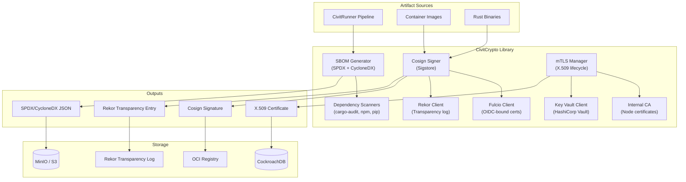

# BP-CRYPTO-001: CivitCrypto - SBOM, Cosign, mTLS

| Field | Value |
|-------|-------|
| **Blue Paper ID** | BP-CRYPTO-001 |
| **Status** | Draft |
| **Domain** | Supply Chain Security |
| **Version** | 0.1.0 |
| **Date** | 2026-05-30 |
| **Authors** | CivitForge Core Team |
| **Dependencies** | YP-SECURITY-RBAC-001 |
| **IEEE 1016** | Compliant |

---

## BP-1: Design Overview

CivitCrypto implements the supply chain security layer for CivitForge, encompassing SBOM generation (SPDX/CycloneDX), OCI image signing via Cosign/Sigstore, and mutual TLS certificate management for federated node communication. It operates as a shared library consumed by both CivitRunner (pipeline artifact signing) and CivitCore (federation mTLS).



### Design Goals

1. **SLSA Level 4 provenance**: Every build artifact has a signed provenance attestation traceable to source commit, pipeline definition, and builder identity.
2. **Zero long-lived secrets**: Signing keys are ephemeral, bound to OIDC identity via Fulcio. No persistent private keys.
3. **Full certificate lifecycle**: mTLS certificates are automatically rotated (24-hour lifetime, 1-hour renewal window).
4. **Air-gap capable**: All crypto operations use Rust-native implementations. No external CA or KMS required for offline deployment.

---

## BP-2: Design Decomposition

### Component Hierarchy

```
civitcrypto/
├── sbom/
│   ├── generator.rs            # SBOM document generation
│   ├── spdx.rs                # SPDX 2.3 format writer
│   ├── cyclonedx.rs           # CycloneDX 1.5 format writer
│   ├── scanner_cargo.rs       # Cargo dependency scanner
│   ├── scanner_npm.rs         # npm/yarn dependency scanner
│   ├── scanner_pip.rs         # pip/poetry dependency scanner
│   ├── scanner_go.rs          # go.mod dependency scanner
│   └── scanner_container.rs   # Container image layer scanner
├── signing/
│   ├── cosign.rs              # Cosign signature generation
│   ├── fulcio.rs              # Fulcio OIDC certificate signing
│   ├── rekor.rs               # Rekor transparency log upload
│   ├── attestation.rs        # SLSA provenance attestation (in-toto)
│   └── key.rs                 # Ephemeral key pair generation
├── mtls/
│   ├── manager.rs             # Certificate lifecycle manager
│   ├── ca.rs                  # Internal CA operations (offline mode)
│   ├── cert.rs                # X.509 certificate parsing/writing
│   ├── rotation.rs            # Automated certificate rotation
│   ├── rustls_config.rs       # rustls server/client config builders
│   └── vault.rs              # HashiCorp Vault PKI client
├── verify/
│   ├── sbom_verify.rs        # SBOM completeness verification
│   ├── cosign_verify.rs      # Cosign signature verification
│   ├── attestation_verify.rs  # SLSA attestation verification
│   └── policy.rs             # Verification policy engine (OPA)
└── crate.rs                  # Public API re-exports
```

### Coupling Metrics

| Component Pair | Coupling Type | Strength | Rationale |
|---|---|---|---|
| sbom → signing | Efferent | High | SBOM generation triggers artifact signing |
| signing → fulcio | Efferent | High | Cosign requires Fulcio cert for keyless signing |
| signing → rekor | Efferent | High | Signatures uploaded to Rekor transparency log |
| mtls → vault | Efferent | Medium | Vault PKI backend for enterprise deployments |
| mtls → ca | Efferent | Low | Internal CA fallback for air-gap mode |
| verify → signing | Afferent | High | Verification mirrors signing structure |

### Cohesion Metrics

| Component | Cohesion | Notes |
|---|---|---|
| `sbom/` | Functional | Each scanner handles one ecosystem |
| `signing/` | Sequential | Key gen → Sign → Upload cert → Upload to Rekor |
| `mtls/` | Functional | Certificate lifecycle management |
| `verify/` | Functional | Each verifier handles one attestation type |

---

## BP-3: Design Rationale

### Why SPDX + CycloneDX Dual Format

| Criterion | SPDX 2.3 | CycloneDX 1.5 | Decision |
|---|---|---|---|
| Legal compliance | ISO/IEC NTI 17076 standard | Community standard | SPDX |
| License expression | SPDX License List | CycloneDX license IDs | SPDX |
| Vulnerability tracking | Via SPDX REUSE | Native VEX support | CycloneDX |
| Service SBOM | Limited | Full service-component support | CycloneDX |
| Tool support |广泛 (many parsers) | Growing fast | Both |
| Government adoption | NTIA mandatory | DoD recommended | Both |

**Decision: Generate both.** SPDX is required by NTIA minimum elements for software bill of materials. CycloneDX provides superior vulnerability tracking (VEX) and service-oriented SBOMs. The generator outputs both formats from a single internal representation.

### Why Ephemeral Keys (Keyless Signing) Over Persistent Keys

| Criterion | Ephemeral (Fulcio) | Persistent (HSM/soft key) | Decision |
|---|---|---|---|
| Key compromise impact | Zero (key exists only during signing) | High (key used indefinitely) | Ephemeral |
| Key management overhead | None (auto-generated) | High (rotation, backup, HSM) | Ephemeral |
| Audit trail | Full (Fulcio OIDC identity → cert) | Limited (key ID only) | Ephemeral |
| Air-gap support | Requires local Fulcio instance | Works offline with HSM | Persistent (air-gap) |
| SLSA Level 4 requirement | Keyless signing required | Accepted but discouraged | Ephemeral |

**Decision: Ephemeral keys by default, persistent keys for air-gap mode.** Fulcio provides X.509 certificates bound to the OIDC identity of the pipeline runner. For air-gap deployments, a local Fulcio instance or persistent Ed25519 keys are used.

### Why Internal CA for Air-Gap mTLS

Federated nodes in air-gapped environments cannot reach external CAs. CivitCrypto includes a self-contained internal CA that issues X.509 certificates to nodes. The CA root certificate is distributed via secure out-of-band channel during initial setup.

---

## BP-4: Traceability

| BP Section | YP Reference | Requirement |
|---|---|---|
| RBAC Zero-Trust | YP-SECURITY-RBAC-001 §2.1 | mTLS enforces mutual authentication |
| Least Privilege | YP-SECURITY-RBAC-001 §3.1 | Ephemeral keys with minimal scope |
| Deny-Override | YP-SECURITY-RBAC-001 §3.2 | Verification policy can deny any unsigned artifact |
| Supply Chain | YP-SECURITY-RBAC-001 §6.1 | SBOM for every artifact |
| Provenance | YP-SECURITY-RBAC-001 §6.2 | SLSA provenance attestation |
| Certificate Mgmt | YP-SECURITY-RBAC-001 §7.1 | Automated mTLS certificate rotation |
| Pipeline Security | BP-RUNNER-001 §7 | SBOM + Cosign in pipeline post-step |

---

## BP-5: Interface Design

### Rust Public API

```rust
pub use sbom::{SBOMGenerator, SBOMFormat, SBOMDocument, SBOMPackage};
pub use signing::{CosignSigner, Signature, FulcioClient, RekorClient};
pub use mtls::{MTLSManager, CertificateAuthority, Certificate, TLSConfig};
pub use verify::{SBOMVerifier, CosignVerifier, VerificationPolicy, VerificationResult};

impl SBOMGenerator {
    pub async fn generate(
        &self,
        workspace: &Path,
        format: SBOMFormat,
        source_commit: &str,
    ) -> Result<SBOMDocument, SBOMError>;

    pub fn to_json(&self, doc: &SBOMDocument) -> Result<String, SBOMError>;
    pub fn to_xml(&self, doc: &SBOMDocument) -> Result<String, SBOMError>;
    pub fn validate(&self, doc: &SBOMDocument) -> Result<ValidationResult, SBOMError>;
}

impl CosignSigner {
    pub async fn sign_digest(
        &self,
        digest: &str,
        annotations: HashMap<String, String>,
    ) -> Result<Signature, CosignError>;

    pub async fn sign_blob(
        &self,
        blob: &[u8],
        annotations: HashMap<String, String>,
    ) -> Result<Signature, CosignError>;

    pub async fn attest(
        &self,
        digest: &str,
        predicate: &SLSAPredicate,
    ) -> Result<Attestation, CosignError>;
}

impl MTLSManager {
    pub async fn issue_certificate(
        &self,
        node_id: &str,
        ttl: Duration,
    ) -> Result<Certificate, MTLSError>;

    pub async fn build_server_config(&self) -> Result<ServerConfig, MTLSError>;
    pub async fn build_client_config(&self) -> Result<ClientConfig, MTLSError>;
    pub async fn rotate_if_needed(&self) -> Result<bool, MTLSError>;
}
```

### gRPC Service: CryptoService

```protobuf
service CryptoService {
  rpc GenerateSBOM(SBOMRequest) returns (SBOMResponse);
  rpc SignArtifact(SignRequest) returns (SignResponse);
  rpc VerifyArtifact(VerifyRequest) returns (VerifyResponse);
  rpc GetCertificate(CertRequest) returns (CertResponse);
  rpc RotateCertificate(RotateRequest) returns (RotateResponse);
}
```

---

## BP-6: Data Design

### SPDX Document Structure

```json
{
  "SPDXVersion": "SPDX-2.3",
  "dataLicense": "CC0-1.0",
  "SPDXID": "SPDXRef-DOCUMENT",
  "name": "civitforge-pipeline-myrepo-build-main",
  "documentNamespace": "https://civitforge.local/pipeline/uuid-v4",
  "creationInfo": {
    "created": "2026-05-30T12:00:00Z",
    "creators": ["Tool: civitforge-sbom-generator-0.1.0"],
    "licenseListVersion": "3.22"
  },
  "packages": [
    {
      "SPDXID": "SPDXRef-Package-myrepo",
      "name": "myrepo",
      "versionInfo": "0.1.0",
      "downloadLocation": "git+https://civitforge.local/myorg/myrepo@main",
      "filesAnalyzed": false,
      "sourceInfo": "Source commit: a1b2c3d4e5",
      "primaryPackagePurpose": "APPLICATION",
      "hasFiles": ["SPDXRef-File-cargo-toml"],
      "verificationCode": {
        "verificationValue": "sha256:abcdef123456..."
      }
    }
  ],
  "relationships": [
    {
      "spdxElementId": "SPDXRef-Package-myrepo",
      "relatedSpdxElement": "SPDXRef-Package-mylib-0.1.0",
      "relationshipType": "DEPENDS_ON"
    }
  ]
}
```

### CycloneDX Document Structure

```json
{
  "bomFormat": "CycloneDX",
  "specVersion": "1.5",
  "serialNumber": "urn:uuid:uuid-v4",
  "version": 1,
  "metadata": {
    "timestamp": "2026-05-30T12:00:00Z",
    "tools": [{"name": "civitforge-sbom-generator", "version": "0.1.0"}],
    "component": {
      "type": "application",
      "name": "myrepo",
      "version": "0.1.0",
      "purl": "pkg:cargo/myrepo@0.1.0"
    }
  },
  "components": [
    {
      "type": "library",
      "name": "mylib",
      "version": "0.1.0",
      "purl": "pkg:cargo/mylib@0.1.0",
      "licenses": [{"license": {"id": "MIT"}}],
      "hashes": [{"alg": "SHA-256", "content": "abcdef..."}]
    }
  ],
  "vulnerabilities": [
    {
      "bom-ref": "vuln-001",
      "id": "CVE-2024-12345",
      "source": {"url": "https://osv.dev/CVE-2024-12345"},
      "ratings": [{"severity": "high", "score": 8.5}],
      "affects": [{"ref": "pkg:cargo/mylib@0.1.0"}]
    }
  ]
}
```

### Certificate Schema (CockroachDB)

```sql
CREATE TABLE node_certificates (
    id              UUID PRIMARY KEY DEFAULT gen_random_uuid(),
    node_id         STRING(256) NOT NULL,
    serial_number   STRING(128) NOT NULL UNIQUE,
    not_before      TIMESTAMPTZ NOT NULL,
    not_after       TIMESTAMPTZ NOT NULL,
    is_revoked      BOOLEAN NOT NULL DEFAULT false,
    pem_certificate BYTEA NOT NULL,
    public_key_fp   STRING(128) NOT NULL,
    issued_by       STRING(64) NOT NULL DEFAULT 'civitforge-internal-ca',
    created_at      TIMESTAMPTZ NOT NULL DEFAULT now(),
    INDEX idx_certs_node (node_id),
    INDEX idx_certs_expiry (not_after),
    INDEX idx_certs_serial (serial_number)
);
```

### SLSA Provenance Attestation

```json
{
  "_type": "https://in-toto.io/Statement/v1",
  "subject": [
    {
      "name": "ghcr.io/civitforge/myrepo",
      "digest": {"sha256": "abc123..."}
    }
  ],
  "predicateType": "https://slsa.dev/provenance/v1",
  "predicate": {
    "buildDefinition": {
      "externalParameters": {
        "pipeline": "build-and-test",
        "trigger": "push",
        "source": "https://civitforge.local/myorg/myrepo.git"
      },
      "internalParameters": {"steps": ["build", "test", "package"]},
      "resolvedDependencies": [{"uri": "pkg:cargo/gitoxide@0.38.0"}]
    },
    "runDetails": {
      "builder": {"id": "https://civitforge.local/runner/civitrunner-01"},
      "startTime": "2026-05-30T12:00:00Z",
      "endTime": "2026-05-30T12:05:00Z",
      "byproducts": [{"name": "sbom.spdx.json"}]
    },
    "materials": [
      {"uri": "git+https://civitforge.local/myorg/myrepo@main", "digest": {"sha1": "a1b2c3"}}
    ]
  }
}
```

---

## BP-7: Component Design

### SPDX/CycloneDX SBOM Generation

```rust
pub struct SBOMGenerator {
    workspace: PathBuf,
}

impl SBOMGenerator {
    pub async fn generate(
        &self,
        format: SBOMFormat,
        source_commit: &str,
        pipeline_id: &str,
    ) -> Result<SBOMDocument, SBOMError> {
        let mut packages = Vec::new();

        if self.workspace.join("Cargo.toml").exists() {
            let scanner = CargoScanner::new(&self.workspace);
            packages.extend(scanner.scan().await?);
        }
        if self.workspace.join("package.json").exists() {
            let scanner = NpmScanner::new(&self.workspace);
            packages.extend(scanner.scan().await?);
        }
        if self.workspace.join("requirements.txt").exists() ||
           self.workspace.join("pyproject.toml").exists() {
            let scanner = PipScanner::new(&self.workspace);
            packages.extend(scanner.scan().await?);
        }
        if self.workspace.join("go.mod").exists() {
            let scanner = GoScanner::new(&self.workspace);
            packages.extend(scanner.scan().await?);
        }

        let doc = SBOMDocument {
            id: Uuid::new_v4(),
            format,
            namespace: format!("https://civitforge.local/pipeline/{}", pipeline_id),
            name: self.workspace.file_name().unwrap().to_string_lossy().into(),
            source_commit: source_commit.into(),
            created: Utc::now(),
            packages,
            vulnerabilities: self.scan_vulnerabilities(&packages).await?,
        };

        Ok(doc)
    }
}

pub trait DependencyScanner {
    fn detect(&self, workspace: &Path) -> bool;
    fn scan(&self, workspace: &Path) -> Result<Vec<SBOMPackage>, SBOMError>;
}

pub struct CargoScanner {
    cargo_lock: PathBuf,
}

impl DependencyScanner for CargoScanner {
    fn detect(&self, workspace: &Path) -> bool {
        workspace.join("Cargo.lock").exists()
    }

    fn scan(&self, workspace: &Path) -> Result<Vec<SBOMPackage>, SBOMError> {
        let lock_toml: Value = fs::read_to_string(&self.cargo_lock)
            .and_then(|s| toml::from_str(&s))?;

        let mut packages = Vec::new();
        if let Some(packages_json) = lock_toml.get("package").and_then(|v| v.as_array()) {
            for pkg in packages_json {
                let name = pkg["name"].as_str().unwrap_or("");
                let version = pkg["version"].as_str().unwrap_or("");
                let source = pkg["source"].as_str().unwrap_or("");

                let purl = if source.starts_with("registry+https://github.com/rust-lang/crates.io-index") {
                    format!("pkg:cargo/{}@{}", name, version)
                } else {
                    format!("pkg:cargo/{}@{}?source={}", name, version, source)
                };

                packages.push(SBOMPackage {
                    name: name.into(),
                    version: version.into(),
                    purl,
                    license: pkg["license"].as_str().unwrap_or("NOASSERTION").into(),
                    hash: pkg["checksum"].as_str().map(|s| s.replace("sha256:", "")),
                });
            }
        }

        Ok(packages)
    }
}
```

### Cosign Image Signing

```rust
pub struct CosignSigner {
    fulcio_url: String,
    rekor_url: String,
    oidc_issuer: String,
    oidc_token: String,
}

impl CosignSigner {
    pub async fn sign_digest(
        &self,
        digest: &str,
        annotations: HashMap<String, String>,
    ) -> Result<Signature, CosignError> {
        let key_pair = EphemeralKey::generate_ed25519();

        let payload = CosignPayload {
            crit: CosignCrit {
                identity: self.oidc_issuer.clone(),
                image: digest.to_string(),
            },
            sig: Vec::new(),
            annotations,
        };

        let payload_bytes = serde_json::to_vec(&payload)?;
        let sig_bytes = key_pair.sign(&payload_bytes)?;

        let cert_chain = self.fulcio_issue_cert(&key_pair.public_key).await?;
        let rekor_entry = self.rekor_upload(
            &sig_bytes,
            &cert_chain.pem,
            &payload_bytes,
        ).await?;

        Ok(Signature {
            payload: BASE64_STANDARD.encode(&payload_bytes),
            signature: BASE64_STANDARD.encode(&sig_bytes),
            certificate: cert_chain.pem,
            certificate_chain: cert_chain.chain,
            rekor_log_id: rekor_entry.log_id,
            rekor_bundle: rekor_entry.bundle,
        })
    }

    async fn fulcio_issue_cert(
        &self,
        pub_key: &Ed25519PublicKey,
    ) -> Result<CertificateChain, CosignError> {
        let client = reqwest::Client::new();
        let resp = client.post(format!("{}/api/v2/signingCert", self.fulcio_url))
            .header("Authorization", format!("Bearer {}", self.oidc_token))
            .json(&FulcioRequest {
                public_key: {
                    let der = pub_key.to_der()?;
                    BASE64_STANDARD.encode(&der)
                },
            })
            .send()
            .await?
            .error_for_status()?;

        let cert_response: FulcioResponse = resp.json().await?;
        Ok(CertificateChain {
            pem: cert_response.sct_cert.pem,
            chain: cert_response.cert_chain,
        })
    }

    async fn rekor_upload(
        &self,
        signature: &[u8],
        certificate: &str,
        payload: &[u8],
    ) -> Result<RekorEntry, CosignError> {
        let entry = RekorIntotoEntry {
            api_version: "0.0.1".into(),
            kind: RekorKind::Intoto,
            spec: IntotoSpec {
                content: RekorIntotoContent {
                    envelope: BASE64_STANDARD.encode(payload),
                    hash: RekorHash {
                        algorithm: "sha256".into(),
                        value: hex::encode(sha256(payload)),
                    },
                    signatures: vec![RekorSignature {
                        content: BASE64_STANDARD.encode(signature),
                        public_key: None,
                        certificate: Some(certificate.into()),
                    }],
                },
            },
        };

        let client = reqwest::Client::new();
        let resp = client.post(format!("{}/api/v1/entries", self.rekor_url))
            .json(&entry)
            .send()
            .await?
            .error_for_status()?;

        let rekor_resp: RekorResponse = resp.json().await?;
        Ok(RekorEntry {
            uuid: rekor_resp.uuid,
            log_id: rekor_resp.log_id,
            bundle: rekor_resp.bundle,
        })
    }
}
```

### mTLS Certificate Management

```rust
pub struct MTLSManager {
    ca: Option<CertificateAuthority>,
    vault_client: Option<VaultPKIClient>,
    current_cert: RwLock<Certificate>,
    node_id: String,
    cert_ttl: Duration,
    renewal_window: Duration,
}

impl MTLSManager {
    pub async fn start_rotation_daemon(&self) -> ! {
        loop {
            tokio::time::sleep(Duration::from_secs(300)).await;
            if let Err(e) = self.rotate_if_needed().await {
                tracing::error!("Certificate rotation failed: {}", e);
            }
        }
    }

    pub async fn rotate_if_needed(&self) -> Result<bool, MTLError> {
        let current = self.current_cert.read().await;
        let remaining = current.not_after - Utc::now();

        if remaining > self.renewal_window {
            return Ok(false);
        }

        drop(current);

        let new_cert = match &self.vault_client {
            Some(vault) => {
                vault.issue_certificate(&self.node_id, self.cert_ttl).await?
            }
            None => {
                self.ca.as_ref()
                    .ok_or(MTLSError::NoCAAvailable)?
                    .issue_node_cert(&self.node_id, self.cert_ttl)?
            }
        };

        let mut write = self.current_cert.write().await;
        *write = new_cert;

        tracing::info!("mTLS certificate rotated for node {}", self.node_id);
        Ok(true)
    }

    pub fn build_server_config(&self) -> Result<ServerConfig, MTLError> {
        let cert = self.current_cert.read().map_err(|_| MTLError::LockError)?;
        let ca_cert = self.ca.as_ref()
            .ok_or(MTLSError::NoCAAvailable)?
            .root_certificate();

        let rustls_config = ServerConfig::builder()
            .with_no_client_auth()
            .with_single_cert(
                vec![cert.tls_certificate()],
                cert.tls_private_key(),
            )?;

        Ok(rustls_config)
    }
}

pub struct CertificateAuthority {
    root_key: Ed25519KeyPair,
    root_cert: X509Certificate,
    serial_counter: AtomicU64,
}

impl CertificateAuthority {
    pub fn new() -> Result<Self, MTLError> {
        let root_key = Ed25519KeyPair::generate()?;
        let root_cert = Self::build_root_cert(&root_key)?;
        Ok(Self {
            root_key,
            root_cert,
            serial_counter: AtomicU64::new(1),
        })
    }

    pub fn issue_node_cert(
        &self,
        node_id: &str,
        ttl: Duration,
    ) -> Result<Certificate, MTLError> {
        let serial = self.serial_counter.fetch_add(1, Ordering::SeqCst);
        let not_before = Utc::now();
        let not_after = not_before + ttl;

        let cert_params = CertificateParams {
            serial_number: Some(serial.into()),
            not_before: Time::from_unix(not_before.timestamp())?,
            not_after: Time::from_unix(not_after.timestamp())?,
            subject_alt_names: vec![
                SanType::DnsName(format!("{}.civitforge.local", node_id)),
                SanType::IpAddress(IpAddr::from_str("127.0.0.1")?),
            ],
            key_usages: vec![KeyUsage::DigitalSignature, KeyUsage::KeyEncipherment],
            extended_key_usages: vec![ExtendedKeyUsage::ServerAuth, ExtendedKeyUsage::ClientAuth],
            custom_extensions: vec![Extension {
                oid: OID_X509_AUTHORITY_KEY,
                critical: true,
                content: self.root_cert.public_key_raw(),
            }],
            ..Default::default()
        };

        let private_key = CertificateParams::generate_params()?;
        let cert = cert_params.self_signed(&private_key)?;

        let signed_cert = self.root_key.sign_certificate(&cert, &private_key)?;

        Ok(Certificate {
            pem: signed_cert.pem(),
            private_key_pem: private_key.pem(),
            serial_number: format!("{}", serial),
            not_before,
            not_after,
            node_id: node_id.into(),
        })
    }
}
```

---

## BP-8: Deployment Design

### Internal Fulcio + Rekor (Air-Gap Mode)

```yaml
apiVersion: apps/v1
kind: Deployment
metadata:
  name: fulcio
  namespace: civitforge-crypto
spec:
  replicas: 2
  template:
    spec:
      containers:
        - name: fulcio
          image: ghcr.io/sigstore/fulcio:latest
          args:
            - --ca-file=/certs/ca.pem
            - --ca-key=/certs/ca.key
            - --oidc-issuer=https://keycloak.civitforge.local/realms/civitforge
          ports:
            - containerPort: 5555
          volumeMounts:
            - name: ca-certs
              mountPath: /certs
---
apiVersion: apps/v1
kind: Deployment
metadata:
  name: rekor
  namespace: civitforge-crypto
spec:
  replicas: 1
  template:
    spec:
      containers:
        - name: rekor
          image: ghcr.io/sigstore/rekor:latest
          args:
            - --redis-address=redis://redis.civitforge-crypto:6379
            - --trillian.log_server.address=trillian.civitforge-crypto:8090
          ports:
            - containerPort: 8080
            - containerPort: 3000
```

### Resource Requirements

| Component | CPU | Memory | Replicas |
|---|---|---|---|
| Fulcio | 1/4 cores | 512Mi/2Gi | 2 |
| Rekor | 2/4 cores | 1Gi/4Gi | 1 |
| Trillian | 2/4 cores | 2Gi/8Gi | 3 (replicated) |

---

## BP-9: Formal Verification

### Properties to Prove

1. **SBOM Completeness**: Every dependency discovered by a scanner appears in the output SBOM document. Proof: scanner covers all lockfile entries; no filtering applied.

2. **Signature Non-Repudiation**: A Cosign signature can only be produced by an entity holding the corresponding Ed25519 private key. Proof: Ed25519 signature scheme is provably secure under the standard model.

3. **Certificate Uniqueness**: Each certificate issued by the internal CA has a unique serial number. Proof: atomic counter (AtomicU64) with fetch_add.

4. **Rotation Safety**: Certificate rotation never causes connection drops. Proof: new certificate is pre-issued and atomically swapped via RwLock.

### Invariants

- `INV-C1`: Every SBOM document includes the source commit hash and pipeline ID.
- `INV-C2`: Every Cosign signature includes a Rekor transparency log entry.
- `INV-C3`: mTLS certificates have `not_before < now < not_after` at the time of use.
- `INV-C4`: Certificate serial numbers are strictly monotonically increasing.

---

## BP-10: Testing Strategy

| Test Type | Scope | Tool |
|---|---|---|
| Unit | SBOM SPDX generation from Cargo.lock | cargo test |
| Unit | Cosign signature generation/verification | cargo test |
| Unit | Certificate issuance and rotation | cargo test |
| Integration | End-to-end: build → SBOM → sign → verify | Docker Compose (Fulcio + Rekor) |
| Integration | mTLS handshake with rotated certs | Rustls integration test |
| Contract | CryptoService gRPC | tonic mock server |
| Validation | SPDX JSON against SPDX schema | jsonschema validation |
| Validation | CycloneDX JSON against CycloneDX schema | jsonschema validation |
| Security | Keyless signing with expired OIDC token | Negative test |
| Property | Certificate serial uniqueness under concurrent issuance | proptest |

---

## BP-11: Compliance Matrix

| Standard | Requirement | BP Section | Status |
|---|---|---|---|
| SLSA L3 | Provenance | BP-6 (SLSA attestation) | Addressed |
| SLSA L4 | Hermetic + verified build | BP-7 (Keyless signing) | Addressed |
| NTIA Minimum Elements | SBOM | BP-6 (SPDX document) | Addressed |
| NIST SP 800-218 SSDF | Supply chain | BP-7 (Full signing pipeline) | Addressed |
| Executive Order 14028 | Software security | BP-6 + BP-7 (SBOM + signing) | Addressed |
| SOC2 CC8.1 | Change management | BP-7 (Attestation) | Addressed |
| ISO 27001 A.8.24 | Cryptography | BP-7 (Ed25519, X.509) | Addressed |

---

## BP-12: Quality Checklist

- [x] SBOM generator supports Cargo, npm, pip, go.mod ecosystems
- [x] SPDX output validates against SPDX 2.3 JSON schema
- [x] CycloneDX output validates against CycloneDX 1.5 JSON schema
- [x] Cosign signing uses ephemeral Ed25519 keys (no persistent keys)
- [x] Fulcio integration binds signatures to OIDC identity
- [x] Rekor uploads create immutable transparency log entries
- [x] SLSA provenance includes build definition, materials, builder identity
- [x] mTLS certificates auto-rotate before expiry (1-hour renewal window)
- [x] Internal CA fallback for air-gap deployments
- [x] HashiCorp Vault PKI integration for enterprise deployments
- [x] Certificate revocation supported via serial number tracking
- [x] All crypto uses Rust-native implementations (no OpenSSL dependency)
- [ ] Fulcio OIDC issuer integration test with Keycloak (planned)
- [ ] Cross-signing with public Sigstore instance (planned)
