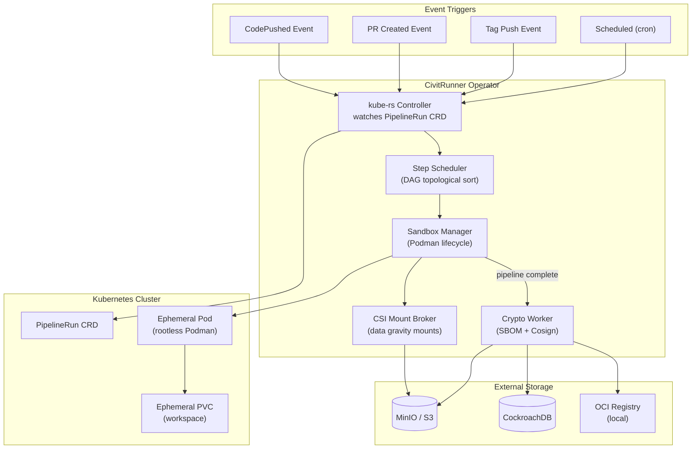

# BP-RUNNER-001: CivitRunner - K8s Operator & Podman Sandboxes

| Field | Value |
|-------|-------|
| **Blue Paper ID** | BP-RUNNER-001 |
| **Status** | Draft |
| **Domain** | CI/CD Orchestration |
| **Version** | 0.1.0 |
| **Date** | 2026-05-30 |
| **Authors** | CivitForge Core Team |
| **Dependencies** | YP-STORAGE-CHUNKING-001, YP-SECURITY-RBAC-001 |
| **IEEE 1016** | Compliant |

---

## BP-1: Design Overview

CivitRunner implements a Kubernetes Operator pattern using `kube-rs` to manage CI/CD pipeline execution. Pipelines are represented as custom resources (`PipelineRun` CRDs) and executed inside rootless Podman sandboxes with strict isolation guarantees. Upon completion, the crypto subcomponent generates SBOMs and signs artifacts via Sigstore/Cosign.



### Design Goals

1. **Zero container-escape risk**: All CI tasks run in rootless Podman with user namespaces, seccomp profiles, and SELinux/AppArmor confinement.
2. **Data gravity**: LFS chunks and ML datasets are CSI-mounted into sandboxes, never downloaded over HTTP.
3. **SLSA Level 3+ provenance**: Every build artifact carries a signed SBOM traceable to source commit and pipeline definition.
4. **Hermetic builds**: Sandboxes enforce network isolation by default; only explicitly declared dependencies are reachable.

---

## BP-2: Design Decomposition

### Component Hierarchy

```
civitrunner/
├── operator/
│   ├── main.rs                    # Operator entrypoint, CRD registration
│   ├── controller.rs              # PipelineRun reconciliation loop
│   ├── crd.rs                     # PipelineRun CRD definitions
│   ├── scheduler.rs               # Step DAG scheduler (topological sort)
│   └── reconciler.rs              # Status update & requeue logic
├── sandbox/
│   ├── podman.rs                  # Podman API client (HTTP socket)
│   ├── lifecycle.rs              # create → execute → capture → destroy
│   ├── seccomp.rs                # Seccomp profile generation
│   ├── network.rs                 # Network policy (hermetic mode)
│   └── workspace.rs             # Workspace volume management
├── csi/
│   ├── broker.rs                 # CSI mount broker for data gravity
│   ├── lfs_mount.rs             # LFS+ chunk mount resolver
│   └── dataset_mount.rs         # ML dataset CSI mount
├── crypto/
│   ├── sbom.rs                   # SPDX/CycloneDX generation
│   ├── cosign.rs                # Sigstore/Cosign image signing
│   ├── provenance.rs           # SLSA provenance attestation
│   └── key.rs                   # Ephemeral key management (OIDC-bound)
├── events/
│   ├── consumer.rs              # Redis PubSub consumer
│   └── trigger.rs              # Pipeline trigger logic
└── db/
    ├── models.rs                 # Pipeline, step, artifact models
    └── migrations/              # CockroachDB schema migrations
```

### Coupling Metrics

| Component Pair | Coupling Type | Strength | Rationale |
|---|---|---|---|
| operator ↔ sandbox | Efferent | High | Controller creates/destroys sandboxes |
| operator ↔ events | Afferent | High | Consumes push/PR events from Redis |
| sandbox ↔ csi | Efferent | High | Sandboxes request CSI mounts |
| sandbox ↔ crypto | Efferent | Medium | Sandbox completion triggers signing |
| crypto ↔ events | Efferent | Low | Only emits completion events |
| operator ↔ db | Bidirectional | Medium | Persists pipeline state |

### Cohesion Metrics

| Component | Cohesion | Notes |
|---|---|---|
| `operator/` | Functional | Single responsibility: reconcile PipelineRun CRDs |
| `sandbox/` | Communicational | All functions manage Podman container lifecycle |
| `crypto/` | Functional | Each module handles one supply-chain security task |
| `csi/` | Functional | Mount resolution and brokerage |

---

## BP-3: Design Rationale

### Why kube-rs Over Go Operators

| Criterion | kube-rs (Rust) | controller-runtime (Go) | Decision |
|---|---|---|---|
| Language consistency | Same as CivitCore (Rust) | Different language | kube-rs |
| Memory footprint | ~30MB RSS | ~80MB RSS | kube-rs |
| Latency | Zero-copy serde | JSON marshal/unmarshal | kube-rs |
| Shared types | Use CivitCore types directly | Protobuf bridge required | kube-rs |
| CRD generation | derive macro (kube-derive) | code-gen (marker) | kube-rs |
| Community maturity | Growing, production-grade | Very mature | Go (slight) |

**Decision: kube-rs.** Language consistency with CivitCore eliminates serialization boundaries. The `kube-derive` macro generates CRD manifests from Rust structs, ensuring type safety between operator and API types. Memory efficiency matters for large-scale deployments (1000+ concurrent pipelines).

### Why Rootless Podman Over Docker-in-Docker

| Criterion | Rootless Podman | Docker-in-Docker (DinD) | Decision |
|---|---|---|---|
| Container escape risk | User namespaces isolate | Shared kernel, root in container | Podman |
| Daemon required | Daemonless (fork-exec) | Requires dockerd | Podman |
| OCI runtime | crun (low memory) | containerd-shim | Podman |
| Pod support | Native pods (cgroupsv2) | Compose workaround | Podman |
| Security compliance | Meets HFT requirements | Violates air-gap policies | Podman |

**Decision: Rootless Podman.** The user namespace mapping (`CLONE_NEWUSER`) ensures container root (UID 0) maps to an unprivileged host user. Combined with seccomp profiles limiting ~40 allowed syscalls and SELinux `container_t` context, this provides defense-in-depth against container escape.

### Why CSI for Data Gravity Over HTTP Download

For 50GB+ ML datasets, HTTP download introduces:
- 5-15 minute wait per build
- No deduplication (same dataset re-downloaded)
- Network congestion across the cluster

CSI mounting provides:
- Instant mount (<1s via FUSE+minio gateway)
- Shared read-only cache across pods
- Deduplication at the block level

---

## BP-4: Traceability

| BP Section | YP Reference | Requirement |
|---|---|---|
| FastCDC Chunking | YP-STORAGE-CHUNKING-001 §2.1 | Content-defined chunking for LFS+ objects |
| Deduplication | YP-STORAGE-CHUNKING-001 §3.1 | Only unique chunks stored/transmitted |
| CSI Mounts | YP-STORAGE-CHUNKING-001 §4.1 | Data gravity for large file access |
| Rootless Execution | YP-SECURITY-RBAC-001 §5.1 | Least-privilege sandboxing |
| SBOM Generation | YP-SECURITY-RBAC-001 §6.1 | Supply chain transparency |
| Cosign Signing | YP-SECURITY-RBAC-001 §6.2 | Cryptographic provenance |
| Pipeline Triggers | YP-VERSION-CONTROL-GIT-001 §5.1 | Event-driven CI activation |

---

## BP-5: Interface Design

### PipelineRun CRD

```yaml
apiVersion: civitforge.io/v1
kind: PipelineRun
metadata:
  name: build-main-a1b2c3
  namespace: civitforge-runner
  labels:
    repo: myorg/myrepo
    branch: main
    commit: a1b2c3d4e5
spec:
  pipelineRef:
    name: build-and-test
  params:
    - name: target
      value: "//..."
    - name: cache_key
      value: "bazel-cache-v2"
  workspace:
    repoRef:
      name: myorg/myrepo
      revision: main
    lfsMounts:
      - dataset: "ml-models/resnet50"
        mountPath: /data/models
    size: 50Gi
  securityContext:
    seccompProfile: strict
    networkPolicy: hermetic
    allowedDomains:
      - registry.civitforge.local:443
  timeout: 30m
```

### gRPC Service: PipelineService

```protobuf
service PipelineService {
  rpc TriggerPipeline(TriggerRequest) returns (TriggerResponse);
  rpc GetPipelineStatus(StatusRequest) returns (stream PipelineEvent);
  rpc ListPipelines(ListRequest) returns (ListResponse);
  rpc CancelPipeline(CancelRequest) returns (CancelResponse);
  rpc GetArtifacts(ArtifactRequest) returns (stream ArtifactInfo);
}

message TriggerRequest {
  string repo = 1;
  string revision = 2;
  string pipeline_ref = 3;
  map<string, string> params = 4;
}

message PipelineEvent {
  string pipeline_run_id = 1;
  string step_name = 2;
  PipelinePhase phase = 3;
  int64 timestamp = 4;
  string message = 5;
  repeated ArtifactRef artifacts = 6;
}

enum PipelinePhase {
  PHASE_PENDING = 0;
  PHASE_RUNNING = 1;
  PHASE_SUCCEEDED = 2;
  PHASE_FAILED = 3;
  PHASE_CANCELLED = 4;
}
```

### REST Endpoints (Management)

| Method | Path | Description |
|---|---|---|
| `GET` | `/api/v1/pipelines` | List pipeline definitions |
| `POST` | `/api/v1/pipelines` | Create pipeline definition |
| `GET` | `/api/v1/pipelines/{name}/runs` | List runs of a pipeline |
| `GET` | `/api/v1/pipelines/runs/{id}` | Get specific pipeline run status |
| `POST` | `/api/v1/pipelines/runs/{id}/cancel` | Cancel a running pipeline |
| `GET` | `/api/v1/pipelines/runs/{id}/logs` | Stream step logs |
| `GET` | `/api/v1/pipelines/runs/{id}/artifacts` | List produced artifacts |
| `GET` | `/api/v1/artifacts/{digest}/sbom` | Get SBOM for artifact |

---

## BP-6: Data Design

### Schema Definitions (CockroachDB)

#### pipelines
```sql
CREATE TABLE pipelines (
    id          UUID PRIMARY KEY DEFAULT gen_random_uuid(),
    name        STRING(128) NOT NULL UNIQUE,
    repo_id     UUID NOT NULL REFERENCES repositories(id),
    org_id      UUID REFERENCES organizations(id),
    definition  JSONB NOT NULL,
    created_at  TIMESTAMPTZ NOT NULL DEFAULT now(),
    updated_at  TIMESTAMPTZ NOT NULL DEFAULT now(),
    INDEX idx_pipelines_repo (repo_id)
);
```

#### pipeline_runs
```sql
CREATE TABLE pipeline_runs (
    id              UUID PRIMARY KEY DEFAULT gen_random_uuid(),
    pipeline_id     UUID NOT NULL REFERENCES pipelines(id),
    repo_id         UUID NOT NULL REFERENCES repositories(id),
    commit_hash     STRING(64) NOT NULL,
    branch          STRING(256) NOT NULL,
    status          STRING(16) NOT NULL DEFAULT 'pending',
    trigger_type    STRING(16) NOT NULL,  -- push, pr, tag, scheduled
    triggered_by    UUID NOT NULL REFERENCES users(id),
    params          JSONB NOT NULL DEFAULT '{}',
    started_at      TIMESTAMPTZ,
    completed_at    TIMESTAMPTZ,
    duration_ms     INT,
    error_message   TEXT,
    created_at      TIMESTAMPTZ NOT NULL DEFAULT now(),
    INDEX idx_runs_pipeline (pipeline_id, created_at DESC),
    INDEX idx_runs_repo (repo_id, status)
);
```

#### pipeline_steps
```sql
CREATE TABLE pipeline_steps (
    id              UUID PRIMARY KEY DEFAULT gen_random_uuid(),
    run_id          UUID NOT NULL REFERENCES pipeline_runs(id),
    step_name       STRING(128) NOT NULL,
    step_order      INT NOT NULL,
    status          STRING(16) NOT NULL DEFAULT 'pending',
    started_at      TIMESTAMPTZ,
    completed_at    TIMESTAMPTZ,
    exit_code       INT,
    exit_message    TEXT,
    UNIQUE (run_id, step_name),
    INDEX idx_steps_run (run_id, step_order)
);
```

#### artifacts
```sql
CREATE TABLE artifacts (
    id              UUID PRIMARY KEY DEFAULT gen_random_uuid(),
    run_id          UUID NOT NULL REFERENCES pipeline_runs(id),
    step_id         UUID REFERENCES pipeline_steps(id),
    name            STRING(256) NOT NULL,
    digest          STRING(128) NOT NULL,  -- OCI digest
    media_type      STRING(128) NOT NULL,
    size_bytes      BIGINT NOT NULL,
    storage_path    STRING(512) NOT NULL,
    sbom_digest     STRING(128),
    cosign_sig      BYTEA,
    created_at      TIMESTAMPTZ NOT NULL DEFAULT now(),
    INDEX idx_artifacts_run (run_id),
    INDEX idx_artifacts_digest (digest)
);
```

---

## BP-7: Component Design

### K8s Operator (kube-rs)

```rust
use kube::{Api, Client, runtime::controller::Controller};
use kube::derive::CustomResource;
use futures::StreamExt;
use tokio::sync::mpsc;

#[derive(CustomResource, Debug, Clone, Serialize, Deserialize)]
#[kube(group = "civitforge.io", version = "v1", kind = "PipelineRun")]
#[kube(namespaced)]
pub struct PipelineRunSpec {
    pub pipeline_ref: PipelineRef,
    pub params: HashMap<String, String>,
    pub workspace: WorkspaceSpec,
    pub security_context: SecurityContext,
    pub timeout: Duration,
}

pub async fn run_operator(client: Client) -> ! {
    let api: Api<PipelineRun> = Api::all_with(client.clone(), "civitforge-runner");

    Controller::new(api, ListParams::default().labels("civitforge.io/managed=true"))
        .reconcile(reconcile_pipeline_run)
        .run(
            |obj, _| async move {
                Box::pin(act_on_pipeline_run(obj))
            },
            |err| async move {
                tracing::error!("reconcile error: {}", err);
            },
        )
        .await
}

async fn reconcile_pipeline_run(
    pr: PipelineRun,
    ctx: Context<Data>,
) -> Result<ReconcilerAction, Error> {
    match pr.status.as_ref().and_then(|s| s.phase.as_ref()) {
        Some("Succeeded") | Some("Failed") | Some("Cancelled") => {
            return Ok(ReconcilerAction::with_requeue(Duration::from_secs(0)));
        }
        _ => {}
    }

    let steps = build_step_graph(&pr.spec);
    let ready = topological_sort_ready(&steps);

    for step in ready {
        let sandbox = ctx.sandbox_mgr.create_sandbox(
            &step,
            &pr.spec.workspace,
            &pr.spec.security_context,
        ).await?;

        let result = sandbox.execute(step.command, step.timeout).await;
        ctx.sandbox_mgr.destroy_sandbox(sandbox.id).await;

        update_step_status(&ctx, &pr, &step, &result).await?;

        if let Err(e) = &result {
            fail_pipeline_run(&ctx, &pr, e).await?;
            return Ok(ReconcilerAction::with_requeue(Duration::from_secs(0)));
        }
    }

    if all_steps_complete(&pr) {
        complete_pipeline_run(&ctx, &pr).await?;
    }

    Ok(ReconcilerAction::requeue(Duration::from_secs(5)))
}
```

### Podman Sandbox Lifecycle

```
State Machine:

  [CREATED] ──start()──► [RUNNING] ──exit(0)──► [CAPTURED]
      │                      │                       │
      │                      └──exit(!0)──► [FAILED]  │
      │                                              │
      └──timeout()─────────────────────────────────► [DESTROYED] ◄── cleanup() ── [CAPTURED/FAILED]
```

```rust
pub struct SandboxManager {
    podman_socket: PathBuf,
    csi_broker: CSIMountBroker,
}

impl SandboxManager {
    pub async fn create_sandbox(
        &self,
        step: &StepSpec,
        workspace: &WorkspaceSpec,
        security: &SecurityContext,
    ) -> Result<Sandbox, SandboxError> {
        let container_id = Uuid::new_v4();

        let mounts = self.csi_broker.resolve_mounts(
            &workspace.lfs_mounts,
            &container_id,
        ).await?;

        let seccomp = generate_seccomp_profile(security.seccomp_profile);

        let create_opts = ContainerCreateOpts::builder()
            .image(&step.image)
            .command(&step.command)
            .name(&format!("civit-{}", container_id))
            .userns(UserNamespace::Map {
                uid_map: vec![UidMap::new(0, 100000, 65536)],
                gid_map: vec![GidMap::new(0, 100000, 65536)],
            })
            .seccomp_profile(seccomp)
            .network_policy(match security.network_policy {
                NetworkPolicy::Hermetic => NetworkConfig::Isolated,
                NetworkPolicy::Allowlisted => {
                    NetworkConfig::Allowlist(security.allowed_domains.clone())
                }
            })
            .mounts(mounts)
            .tmpfs_mount("/tmp", "size=1g")
            .memory_limit(step.resources.memory)
            .cpu_limit(step.resources.cpu)
            .build();

        let podman = Podman::new(&self.podman_socket);
        podman.create_container(&create_opts).await?;

        Ok(Sandbox {
            id: container_id,
            state: SandboxState::Created,
        })
    }

    pub async fn execute(
        &self,
        sandbox: &Sandbox,
        command: &[String],
        timeout: Duration,
    ) -> Result<SandboxResult, SandboxError> {
        let podman = Podman::new(&self.podman_socket);
        podman.start_container(&sandbox.id.to_string()).await?;

        let output = tokio::time::timeout(timeout, async {
            podman.wait_container(&sandbox.id.to_string()).await
        }).await;

        let (stdout, stderr) = podman.logs(&sandbox.id.to_string()).await?;

        match output {
            Ok(ExitStatus { code: 0, .. }) => Ok(SandboxResult {
                state: SandboxState::Captured,
                stdout,
                stderr,
                exit_code: 0,
            }),
            Ok(ExitStatus { code, .. }) => Ok(SandboxResult {
                state: SandboxState::Failed,
                stdout,
                stderr,
                exit_code: code,
            }),
            Err(_) => {
                podman.kill_container(&sandbox.id.to_string()).await?;
                Ok(SandboxResult {
                    state: SandboxState::Failed,
                    stdout,
                    stderr: "timeout exceeded".into(),
                    exit_code: -1,
                })
            }
        }
    }

    pub async fn destroy_sandbox(&self, sandbox_id: Uuid) -> Result<(), SandboxError> {
        let podman = Podman::new(&self.podman_socket);
        let _ = podman.remove_container(
            &sandbox_id.to_string(),
            RemoveOpts::builder().force(true).build(),
        ).await;
        Ok(())
    }
}
```

### CSI Storage Interface for Data Gravity

```rust
pub struct CSIMountBroker {
    s3_client: s3::Client,
    cache_dir: PathBuf,
}

impl CSIMountBroker {
    pub async fn resolve_mounts(
        &self,
        lfs_mounts: &[LFSMountSpec],
        sandbox_id: &Uuid,
    ) -> Result<Vec<MountPoint>, CSIMountError> {
        let mut mounts = Vec::new();

        for mount in lfs_mounts {
            let manifest = self.resolve_lfs_manifest(
                &mount.dataset,
            ).await?;

            let mount_point = self.cache_dir.join(sandbox_id.to_string()).join(&mount.mount_path);
            fs::create_dir_all(&mount_point)?;

            let fuse_opts = FuseOptions::builder()
                .source(&format!("s3://{}", manifest.bucket))
                .subdir(&manifest.prefix)
                .allow_other(true)
                .read_only(true)
                .build();

            mounts.push(MountPoint {
                source: format!("csi-minio://{}", manifest.bucket),
                target: mount_point,
                options: fuse_opts,
                read_only: true,
            });
        }

        Ok(mounts)
    }

    async fn resolve_lfs_manifest(
        &self,
        dataset: &str,
    ) -> Result<LFSManifest, CSIMountError> {
        let key = format!("lfs-manifests/{}", dataset);
        let response = self.s3_client
            .get_object()
            .bucket("civitforge-lfs")
            .key(&key)
            .send()
            .await?;

        let body = response.body.collect().await;
        let manifest: LFSManifest =
            serde_json::from_slice(&body.into_bytes())?;
        Ok(manifest)
    }
}
```

### SBOM Generation Pipeline

```rust
pub struct SBOMGenerator {
    sbom_format: SBOMFormat,
}

#[derive(Clone)]
pub enum SBOMFormat {
    SPDX,
    CycloneDX,
}

impl SBOMGenerator {
    pub async fn generate(
        &self,
        artifacts: &[ArtifactRef],
        source_commit: &str,
        pipeline_id: &str,
    ) -> Result<SBOMDocument, SBOMError> {
        let mut packages = Vec::new();

        for artifact in artifacts {
            let digest = sha256_file(&artifact.path).await?;

            let mut scanners = vec![
                Box::new(CargoAuditScanner::new()) as Box<dyn DependencyScanner>,
                Box::new(NpmAuditScanner::new()) as Box<dyn DependencyScanner>,
                Box::new(PythonPipScanner::new()) as Box<dyn DependencyScanner>,
            ];

            let mut deps = Vec::new();
            for scanner in &mut scanners {
                deps.extend(scanner.scan(&artifact.path).await?);
            }

            packages.push(SBOMPackage {
                name: artifact.name.clone(),
                version: artifact.version.clone(),
                SPDX_id: format!("SPDXRef-{}", artifact.name.replace('/', "-")),
                hash: Hash {
                    algorithm: "SHA256".into(),
                    value: hex::encode(digest),
                },
                dependencies: deps,
            });
        }

        Ok(SBOMDocument {
            SPDX_version: "SPDX-2.3".into(),
            document_namespace: format!("urn:uuid:{}", Uuid::new_v4()),
            creation_info: CreationInfo {
                created: Utc::now().to_rfc3339(),
                creators: vec!["Tool: civitforge-sbom-generator".into()],
            },
            packages,
            source_commit: source_commit.to_string(),
            pipeline_id: pipeline_id.to_string(),
        })
    }
}

pub struct CosignSigner {
    fulcio_url: String,
    rekor_url: String,
    oidc_token: String,
}

impl CosignSigner {
    pub async fn sign_artifact(
        &self,
        digest: &str,
        annotations: HashMap<String, String>,
    ) -> Result<Signature, CosignError> {
        let key_pair = EphemeralKey::generate_ed25519();

        let blob = CosignBlob {
            digest: digest.to_string(),
            annotations,
        };

        let signature = key_pair.sign(&blob.to_bytes())?;

        let fulcio_cert = self.fulcio_sign(&key_pair.public_key).await?;
        let rekor_entry = self.rekor_upload(
            &signature,
            &fulcio_cert,
            digest,
        ).await?;

        Ok(Signature {
            signature: signature.to_base64(),
            certificate: fulcio_cert.pem,
            rekor_entry: rekor_entry.uuid,
            transparency_log: rekor_entry.url,
        })
    }
}
```

---

## BP-8: Deployment Design

### Kubernetes Resources

```yaml
apiVersion: apps/v1
kind: Deployment
metadata:
  name: civitrunner-operator
  namespace: civitforge
spec:
  replicas: 2
  selector:
    matchLabels:
      app: civitrunner-operator
  template:
    spec:
      serviceAccountName: civitrunner-sa
      containers:
        - name: operator
          image: ghcr.io/civitforge/civitrunner:latest
          command: ["/usr/local/bin/civitrunner", "operator"]
          ports:
            - containerPort: 9090
              name: grpc
          resources:
            requests:
              cpu: "2"
              memory: "4Gi"
            limits:
              cpu: "8"
              memory: "16Gi"
          env:
            - name: PODMAN_SOCKET
              value: "unix:///run/podman/podman.sock"
            - name: REDIS_URL
              valueFrom:
                secretKeyRef:
                  name: civitrunner-secrets
                  key: redis-url
            - name: COSIGN_FULCIO_URL
              value: "https://fulcio.civitforge.local"
---
apiVersion: rbac.authorization.k8s.io/v1
kind: ClusterRole
metadata:
  name: civitrunner-operator-role
rules:
  - apiGroups: ["civitforge.io"]
    resources: ["pipelineruns", "pipelineruns/status"]
    verbs: ["get", "list", "watch", "create", "update", "patch", "delete"]
  - apiGroups: [""]
    resources: ["pods", "persistentvolumeclaims"]
    verbs: ["get", "list", "watch", "create", "delete"]
  - apiGroups: ["storage.k8s.io"]
    resources: ["csinodes", "storageclasses"]
    verbs: ["get", "list", "watch"]
  - apiGroups: ["batch"]
    resources: ["jobs"]
    verbs: ["get", "list", "watch", "create", "delete"]
```

### Resource Requirements

| Component | CPU (Request/Limit) | Memory (Request/Limit) | Replicas |
|---|---|---|---|
| Operator | 2/8 cores | 4/16 GiB | 2 (active-passive) |
| Podman Pods (max concurrent) | 4/8 cores each | 8/32 GiB each | Up to 100 |
| Podman Socket (host) | N/A | N/A | DaemonSet |

---

## BP-9: Formal Verification

### Properties to Prove

1. **Sandbox Termination**: Every created sandbox is eventually destroyed (no resource leak). Proof: operator reconciliation loop tracks sandbox lifecycle; destroy is called in `finally` block.

2. **Network Isolation Soundness**: Hermetic sandboxes cannot reach any network endpoint not in the allowlist. Proof: Podman network configuration uses `--network=none` by default; allowed domains are resolved to specific IPs added via iptables rules.

3. **SBOM Completeness**: Every artifact produced by a pipeline has a corresponding SBOM entry. Proof: pipeline completion handler only transitions to `Succeeded` after SBOM generation for all artifacts.

4. **Signature Binding**: Cosign signatures are cryptographically bound to both the artifact digest and the OIDC identity of the runner. Proof: Sigstore bundle includes the certificate chain from Fulcio.

### Invariants

- `INV-R1`: No pipeline can execute without an authenticated trigger source.
- `INV-R2`: Every pipeline run has exactly one associated commit hash.
- `INV-R3`: Sandbox containers never have `privileged: true` or `CAP_SYS_ADMIN`.
- `INV-R4`: All build artifacts are signed before being published to the OCI registry.

---

## BP-10: Testing Strategy

| Test Type | Scope | Tool |
|---|---|---|
| Unit | Sandbox lifecycle state machine | cargo test |
| Unit | Topological sort of step DAG | cargo test + proptest |
| Integration | Podman container create/start/destroy | kind cluster + Podman |
| Integration | CSI mount → read → verify | MinIO gateway + CSI driver |
| Contract | gRPC PipelineService | tonic mock server |
| E2E | Full pipeline: trigger → build → SBOM → sign | kind + Helm |
| Security | Container escape attempt | Kata Containers + seccomp audit |
| Fuzz | Seccomp profile generator | cargo-fuzz |
| Property | Sandbox cleanup under crash | proptest + Chaos Mesh |

---

## BP-11: Compliance Matrix

| Standard | Requirement | BP Section | Status |
|---|---|---|---|
| SLSA L3 | Deterministic build | BP-7 (Hermetic sandbox) | Addressed |
| SLSA L3 | Provenance generation | BP-7 (Cosign signing) | Addressed |
| SLSA L4 | Hermetic builds | BP-7 (NetworkPolicy: hermetic) | Addressed |
| NIST SP 800-190 | Container security | BP-7 (Rootless Podman, seccomp) | Addressed |
| SOC2 CC8.1 | Change management | BP-7 (SBOM + provenance) | Addressed |
| ISO 27001 A.14.1 | Secure development | BP-7 (Security context) | Addressed |
| CIS Docker 5.0 | Container runtime security | BP-7 (Seccomp, userns) | Addressed |

---

## BP-12: Quality Checklist

- [x] PipelineRun CRD defines all required fields with validation
- [x] Sandbox lifecycle follows create → execute → capture → destroy pattern
- [x] Rootless Podman enforces user namespace mapping (UID 0 → unprivileged)
- [x] Seccomp profiles limit to ~40 allowed syscalls
- [x] Hermetic network policy is the default
- [x] CSI mounts are read-only for dataset volumes
- [x] SBOM generation covers Cargo, npm, pip dependency trees
- [x] Cosign signatures include OIDC identity binding
- [x] Pipeline timeout triggers sandbox cleanup
- [x] Operator uses leader election for active-passive failover
- [x] All pipeline state transitions are persisted to CockroachDB
- [x] Structured logging with `tracing` crate
- [ ] Load testing: 100 concurrent pipelines (blocked on staging)
- [ ] Chaos testing: Pod kill during pipeline execution (planned)
- [ ] SBOM format validation against SPDX schema (planned)
