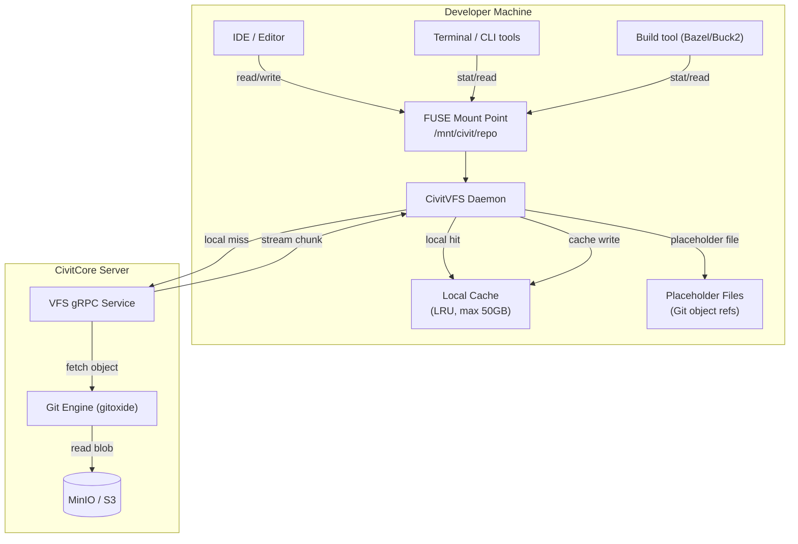

# BP-VFS-001: CivitVFS - FUSE Daemon & On-Demand Fetch

| Field | Value |
|-------|-------|
| **Blue Paper ID** | BP-VFS-001 |
| **Status** | Draft |
| **Domain** | Virtual File System |
| **Version** | 0.1.0 |
| **Date** | 2026-05-30 |
| **Authors** | CivitForge Core Team |
| **Dependencies** | YP-VERSION-CONTROL-GIT-001 |
| **IEEE 1016** | Compliant |

---

## BP-1: Design Overview

CivitVFS provides a virtual file system layer that allows developers to mount terabyte-scale repositories locally without downloading the entire working tree. Files are fetched on-demand via gRPC from the CivitCore server and cached locally using an LRU eviction policy. The implementation uses the `fuser` crate (Rust FUSE bindings) for filesystem operations.



### Design Goals

1. **Sub-second mount**: Repository appears available in <1s regardless of size.
2. **On-demand fetch**: Only files actually read are downloaded from the server.
3. **Transparent to tools**: Bazel, cargo, go build, etc. work unmodified.
4. **Offline-capable**: Cached files remain available when disconnected.
5. **Sparse checkout aware**: Respects `.gitignore` and sparse checkout profiles to minimize fetch scope.

---

## BP-2: Design Decomposition

### Component Hierarchy

```
civitvfs/
├── fuse/
│   ├── daemon.rs               # FUSE daemon entrypoint, mount options
│   ├── callbacks.rs            # FUSE operation implementations
│   ├── inode.rs               # Inode table management
│   ├── dir_cache.rs           # Directory listing cache
│   └── file_handle.rs         # Open file handle tracking
├── client/
│   ├── grpc.rs                # gRPC client for VFS fetch service
│   ├── retry.rs               # Exponential backoff with jitter
│   └── pool.rs               # Connection pool
├── cache/
│   ├── lru.rs                  # LRU eviction policy
│   ├── disk.rs                # On-disk cache (content-addressable)
│   ├── meta.rs                # Cache metadata (LRU index, sizes)
│   └── cleanup.rs            # Background cleanup goroutine
├── placeholder/
│   ├── generator.rs           # Placeholder file creation
│   ├── hydration.rs           # Background prefetch / hydration
│   └── manifest.rs            # Sparse checkout manifest
├── prefetch/
│   ├── build_aware.rs         # Build graph-aware prefetch (Bazel/Buck2)
│   ├── pattern.rs            # Pattern-based prefetch (file globs)
│   └── daemon.rs             # Background prefetch daemon
└── sync/
    ├── watcher.rs            # Filesystem change watcher (notify crate)
    └── upload.rs             # Modified file upload on write
```

### Coupling Metrics

| Component Pair | Coupling Type | Strength | Rationale |
|---|---|---|---|
| fuse → cache | Bidirectional | High | FUSE callbacks check cache, then fetch and populate |
| fuse → client | Efferent | High | Cache miss triggers gRPC fetch |
| cache → placeholder | Bidirectional | Medium | Placeholders track which files need hydration |
| prefetch → cache | Efferent | Medium | Prefetch populates cache proactively |
| sync → client | Efferent | Medium | File writes uploaded to server |

### Cohesion Metrics

| Component | Cohesion | Notes |
|---|---|---|
| `fuse/` | Communicational | All functions operate on FUSE inodes/files |
| `cache/` | Functional | LRU eviction, disk persistence, metadata tracking |
| `placeholder/` | Functional | Placeholder generation and hydration tracking |
| `prefetch/` | Functional | Build-aware and pattern-based prefetch strategies |

---

## BP-3: Design Rationale

### Why FUSE Over GVFS Protocol

| Criterion | FUSE (fuser) | GVFS Protocol (custom) | Decision |
|---|---|---|---|
| Kernel integration | FUSE kernel module (Linux, macOS) | Requires custom kernel extension or WSL2 | FUSE |
| Tool compatibility | Any tool using POSIX syscalls | Requires GVFS-aware client | FUSE |
| Portability | Linux (native), macOS (osxfuse), Windows (WinFsp) | Windows only (native) | FUSE |
| Rust ecosystem | `fuser` crate (production) | No Rust library | FUSE |
| Performance | ~2μs per FUSE call (kernel overhead) | Zero-copy (shared memory) | GVFS (slight) |
| Maintenance | Kernel module maintained by OS vendor | Must maintain custom protocol | FUSE |

**Decision: FUSE.** POSIX compatibility ensures any tool (Bazel, cargo, grep, IDE) works unmodified. The ~2μs FUSE syscall overhead is negligible compared to network fetch latency. The `fuser` crate provides a safe Rust interface to libfuse3.

### Why Content-Addressable On-Disk Cache

Storing cache entries by their content hash (SHA-256) provides:
- Automatic deduplication: same file content across different paths shares one cache entry
- Corruption detection: verify hash on read; discard on mismatch
- Eviction simplicity: delete oldest entries; no reference counting needed
- Background hydration safety: concurrent writes of same content are idempotent

---

## BP-4: Traceability

| BP Section | YP Reference | Requirement |
|---|---|---|
| On-demand fetch | YP-VERSION-CONTROL-GIT-001 §2.3 | Objects fetched lazily, not eagerly |
| Content-addressable storage | YP-VERSION-CONTROL-GIT-001 §2.1 | Objects identified by SHA-256 hash |
| Packfile streaming | YP-VERSION-CONTROL-GIT-001 §3.2 | Packfile data streamed to client |
| LFS+ chunk fetching | YP-STORAGE-CHUNKING-001 §4.1 | Large files fetched via chunk protocol |
| gRPC protocol | YP-VERSION-CONTROL-GIT-001 §5.1 | Internal RPC for VFS operations |

---

## BP-5: Interface Design

### FUSE Operations

The CivitVFS daemon implements the following FUSE callbacks:

| Operation | Behavior |
|---|---|
| `lookup(path)` | Resolve path to inode. If not cached, return placeholder inode. |
| `getattr(path)` | Return file attributes (size, mode, mtime). Placeholder files report size 0. |
| `readdir(path)` | Return directory entries from cached tree or fetch from server. |
| `read(path, offset, size)` | If cached, read from local cache. If placeholder, trigger hydration (fetch from server), then read. |
| `write(path, offset, data)` | Write to cache, mark dirty, schedule upload to server. |
| `open(path, flags)` | Track open file handle. For read-only, allow placeholders. For write, hydrate first. |
| `release(path, flags)` | Close file handle, flush if dirty. |
| `statfs(path)` | Report filesystem stats (total size = repo size, free = cache remaining). |

### gRPC Protocol: VFSFetchService

```protobuf
service VFSFetchService {
  rpc GetObject(VFSObjectRequest) returns (stream VFSObjectChunk);
  rpc ListTree(VFSTreeRequest) returns (VFSTreeResponse);
  rpc Prefetch(VFSPrefetchRequest) returns (VFSPrefetchResponse);
  rpc ResolvePlaceholders(ResolveRequest) returns (stream ResolveResponse);
  rpc UploadModified(UploadRequest) returns (UploadResponse);
}

message VFSObjectRequest {
  string repo = 1;
  string commit = 2;
  string path = 3;
  string object_hash = 4;  // SHA-256 of the blob
}

message VFSObjectChunk {
  bytes data = 1;
  int64 offset = 2;
  bool is_last = 3;
}

message VFSTreeRequest {
  string repo = 1;
  string commit = 2;
  string path = 3;  // Empty for root
}

message VFSTreeResponse {
  repeated VFSTreeEntry entries = 1;
}

message VFSTreeEntry {
  string name = 1;
  string mode = 2;  // "100644", "100755", "040000"
  string object_hash = 3;
  int64 size = 4;
}

message VFSPrefetchRequest {
  string repo = 1;
  string commit = 2;
  repeated string paths = 3;  // Files to prefetch
}

message VFSPrefetchResponse {
  int32 prefetched = 1;
  int32 already_cached = 2;
  int64 bytes_transferred = 3;
}

message UploadRequest {
  string repo = 1;
  string branch = 2;
  string path = 3;
  string old_object_hash = 4;
  string new_object_hash = 5;
  bytes content = 6;
}

message UploadResponse {
  bool success = 1;
  string commit_hash = 2;
  string error_message = 3;
}
```

### CLI Interface

```bash
# Mount a repository
civitvfs mount --repo myorg/myrepo --ref main /mnt/civit/myrepo

# Unmount
civitvfs unmount /mnt/civit/myrepo

# Prefetch specific paths
civitvfs prefetch --paths "src/**/*.rs" --paths "Cargo.toml" --paths "Cargo.lock"

# Build-aware prefetch (reads Bazel BUILD files to determine dependencies)
civitvfs prefetch --build-aware --target "//src/core:all"

# Check cache status
civitvfs cache stats
civitvfs cache cleanup --max-size 50GB

# Upload local modifications
civitvfs push --path src/lib.rs --branch feature/my-change
```

---

## BP-6: Data Design

### On-Disk Cache Layout

```
~/.cache/civitvfs/
├── cache/
│   └── objects/
│       ├── ab/
│       │   └── cd1234...  # SHA-256 prefix hierarchy (content-addressed)
│       └── ef/
│           └── 5678ab...
├── meta/
│   ├── lru_index.db        # SQLite: (object_hash, last_access, size, ref_count)
│   ├── mount_state.db      # SQLite: (mount_path, repo, commit, mounted_at)
│   └── placeholders.db    # SQLite: (path, object_hash, state: pending/hydrated)
├── repos/
│   └── {org}/{name}/
│       ├── HEAD             # Current commit reference
│       ├── refs/            # Branch and tag references
│       └── index            # VFS index (path → object_hash mapping)
└── config.toml              # Cache configuration
```

### Cache Metadata Schema (SQLite)

```sql
CREATE TABLE lru_index (
    object_hash    TEXT PRIMARY KEY,
    last_access    INTEGER NOT NULL,  -- Unix timestamp
    size           INTEGER NOT NULL,
    ref_count      INTEGER NOT NULL DEFAULT 1,
    compression    TEXT NOT NULL DEFAULT 'zstd'
);

CREATE INDEX idx_lru_access ON lru_index(last_access);

CREATE TABLE mount_state (
    mount_path     TEXT PRIMARY KEY,
    repo           TEXT NOT NULL,
    commit         TEXT NOT NULL,
    branch         TEXT NOT NULL,
    mounted_at     INTEGER NOT NULL,
    cache_entries  INTEGER NOT NULL DEFAULT 0,
    cache_bytes    INTEGER NOT NULL DEFAULT 0
);

CREATE TABLE placeholders (
    path           TEXT NOT NULL,
    object_hash    TEXT NOT NULL,
    state          TEXT NOT NULL DEFAULT 'pending',  -- pending, hydrating, hydrated
    mount_path     TEXT NOT NULL,
    PRIMARY KEY (mount_path, path)
);
```

---

## BP-7: Component Design

### FUSE Daemon

```rust
use fuser::{Request, Response, Server, KernelConfig};
use fuser:: FileType;

pub struct CivitVFS {
    mount_point: PathBuf,
    cache: DiskCache,
    grpc_client: VFSClient,
    inode_table: InodeTable,
}

impl CivitVFS {
    pub fn mount(&self) -> Result<(), VFSError> {
        let options = KernelConfig::default()
            .allow_other(false)
            .auto_inval_data(true)
            .no_open_support(false)
            .max_read(1048576);  // 1MB read chunks

        Server::new(options)
            .mount(&self.mount_point, self)
    }
}

impl fuser::Filesystem for &CivitVFS {
    fn lookup(&mut self, req: &Request, parent: u64, name: &OsStr, reply: fuser::ReplyEntry) {
        let path = self.inode_table.resolve_path(parent, name);
        let path_str = path.to_string_lossy();

        match self.cache.get_attr(&path_str) {
            Some(attr) => {
                reply.entry(&TTL, &attr, 0);
            }
            None => {
                let placeholder_attr = FileAttr {
                    kind: FileType::RegularFile,
                    perm: 0o644,
                    nlink: 1,
                    uid: req.uid(),
                    gid: req.gid(),
                    rdev: 0,
                    size: 0,  // Placeholder: zero size
                    blocks: 0,
                    atime: UNIX_EPOCH,
                    mtime: UNIX_EPOCH,
                    ctime: UNIX_EPOCH,
                    crtime: UNIX_EPOCH,
                };
                let ino = self.inode_table.allocate_placeholder(path.clone());
                reply.entry(&TTL, &placeholder_attr, ino);
            }
        }
    }

    fn read(&mut self, _req: &Request, ino: u64, offset: i64, size: u32, reply: fuser::ReplyData) {
        let path = match self.inode_table.get_path(ino) {
            Some(p) => p,
            None => { reply.error(libc::ENOENT); return; }
        };

        if let Some(data) = self.cache.read_file(&path, offset as usize, size as usize) {
            reply.data(&data);
            return;
        }

        let object_hash = self.inode_table.get_object_hash(ino);
        match self.grpc_client.fetch_object(&path, &object_hash).await {
            Ok(data) => {
                self.cache.write_file(&path, &data);
                let start = offset as usize;
                let end = (offset as usize + size as usize).min(data.len());
                reply.data(&data[start..end]);
            }
            Err(e) => {
                tracing::error!("VFS fetch failed for {}: {}", path.display(), e);
                reply.error(libc::EIO);
            }
        }
    }

    fn readdir(&mut self, _req: &Request, ino: u64, offset: i64, reply: fuser::ReplyDirectory) {
        if let Some(entries) = self.cache.readdir(ino) {
            for (i, (name, kind, ino_child)) in entries.into_iter().enumerate().skip(offset as usize) {
                if reply.add(ino_child, (i + 1) as i64, kind, name) { break; }
            }
            reply.ok();
        } else {
            match self.grpc_client.list_tree(ino).await {
                Ok(entries) => {
                    for (i, entry) in entries.iter().enumerate().skip(offset as usize) {
                        let ino_child = self.inode_table.allocate(entry.path.clone(), entry.hash.clone());
                        if reply.add(ino_child, (i + 1) as i64, entry.file_type, OsStr::new(&entry.name)) { break; }
                    }
                    self.cache.cache_dir(ino, &entries);
                    reply.ok();
                }
                Err(_) => reply.error(libc::EIO),
            }
        }
    }
}
```

### gRPC On-Demand Object Fetch Protocol

```rust
use tonic::{Request, Response, Streaming};
use tokio_stream::StreamExt;

pub struct VFSFetchServiceImpl {
    git_engine: Arc<GitEngine>,
    object_store: Arc<S3ObjectStore>,
}

#[tonic::async_trait]
impl VFSFetchService for VFSFetchServiceImpl {
    type GetObjectStream = Pin<Box<dyn Stream<Item = Result<VFSObjectChunk, Status>> + Send>>;

    async fn get_object(
        &self,
        request: Request<VFSObjectRequest>,
    ) -> Result<Response<Self::GetObjectStream>, Status> {
        let req = request.into_inner();
        let git_engine = self.git_engine.clone();
        let object_store = self.object_store.clone();

        let stream = async_stream::stream! {
            let data = object_store.get_object(&req.object_hash).await
                .map_err(|e| Status::internal(e.to_string()))?;

            const CHUNK_SIZE: usize = 1048576;  // 1MB chunks
            for (offset, chunk) in data.chunks(CHUNK_SIZE).enumerate() {
                yield Ok(VFSObjectChunk {
                    data: chunk.to_vec().into(),
                    offset: (offset * CHUNK_SIZE) as i64,
                    is_last: chunk.len() < CHUNK_SIZE,
                });
            }
        };

        Ok(Response::new(Box::pin(stream)))
    }

    async fn list_tree(
        &self,
        request: Request<VFSTreeRequest>,
    ) -> Result<Response<VFSTreeResponse>, Status> {
        let req = request.into_inner();
        let tree = self.git_engine.read_tree(&req.repo, &req.commit, &req.path).await
            .map_err(|e| Status::not_found(e.to_string()))?;

        let entries = tree.entries().map(|e| VFSTreeEntry {
            name: e.name().to_string(),
            mode: e.mode().to_string(),
            object_hash: e.hash().to_hex().to_string(),
            size: e.size(),
        }).collect();

        Ok(Response::new(VFSTreeResponse { entries }))
    }
}
```

### Local Cache Management (LRU Eviction)

```rust
pub struct DiskCache {
    cache_dir: PathBuf,
    db: rusqlite::Connection,
    max_size_bytes: u64,
    compression: CompressionAlgorithm,
}

impl DiskCache {
    pub fn write_file(&self, path: &str, data: &[u8]) -> Result<(), CacheError> {
        let hash = sha256(data);
        let object_path = self.hash_to_path(&hash);

        if !object_path.exists() {
            let compressed = self.compress(data);
            fs::write(&object_path, &compressed)?;
        }

        self.db.execute(
            "INSERT OR REPLACE INTO lru_index (object_hash, last_access, size) VALUES (?1, ?2, ?3)",
            params![hex::encode(hash), now_epoch(), data.len()],
        )?;

        self.enforce_size_limit()?;
        Ok(())
    }

    fn enforce_size_limit(&self) -> Result<(), CacheError> {
        let total: u64 = self.db.query_row(
            "SELECT COALESCE(SUM(size), 0) FROM lru_index", [], |r| r.get(0),
        )?;

        if total <= self.max_size_bytes {
            return Ok(());
        }

        let target = self.max_size_bytes * 8 / 10;  // Evict to 80%
        let mut to_free = total - target;

        let mut stmt = self.db.prepare(
            "SELECT object_hash, size FROM lru_index ORDER BY last_access ASC"
        )?;

        let entries: Vec<(String, u64)> = stmt.query_map([], |r| {
            Ok((r.get::<_, String>(0)?, r.get::<_, u64>(1)?))
        })?.filter_map(|r| r.ok()).collect();

        for (hash, size) in entries {
            if to_free == 0 { break; }
            let object_path = self.hash_to_path(&hash);
            let _ = fs::remove_file(&object_path);
            self.db.execute("DELETE FROM lru_index WHERE object_hash = ?1", [hash])?;
            to_free = to_free.saturating_sub(size);
        }

        Ok(())
    }

    pub fn read_file(&self, path: &str, offset: usize, size: usize) -> Option<Vec<u8>> {
        let hash: String = self.db.query_row(
            "SELECT object_hash FROM lru_index ORDER BY last_access DESC LIMIT 1",
            [],
            |r| r.get(0),
        ).ok()?;

        let object_path = self.hash_to_path(&hash);
        let compressed = fs::read(&object_path).ok()?;
        let data = self.decompress(&compressed);
        self.touch(&hash);
        Some(data[offset..(offset + size).min(data.len())].to_vec())
    }

    fn touch(&self, hash: &str) {
        let _ = self.db.execute(
            "UPDATE lru_index SET last_access = ?1 WHERE object_hash = ?2",
            params![now_epoch(), hash],
        );
    }
}
```

---

## BP-8: Deployment Design

### Client-Side Deployment

CivitVFS runs as a user-space daemon on developer machines:

```bash
# Install
cargo install civitvfs --git https://github.com/civitforge/civitvfs

# Mount (foreground)
civitvfs mount --repo myorg/monorepo --ref main /mnt/civit/monorepo

# Mount (background daemon)
civitvfs mount --daemon --repo myorg/monorepo --ref main /mnt/civit/monorepo

# Systemd unit (Linux)
# /etc/systemd/user/civitvfs.service
[Unit]
Description=CivitVFS Mount
After=network-online.target

[Service]
Type=notify
ExecStart=/usr/local/bin/civitvfs mount --repo myorg/monorepo --ref main /mnt/civit/monorepo
Restart=on-failure

[Install]
WantedBy=default.target
```

### Resource Requirements (Client-Side)

| Resource | Requirement |
|---|---|
| OS | Linux 5.16+, macOS 12+, Windows 10+ (WinFsp) |
| Kernel module | fuse3 (Linux), osxfuse (macOS), WinFsp (Windows) |
| RAM | 128-512 MB (daemon + FUSE page cache) |
| Disk | Configurable, default 50GB cache max |
| Network | gRPC over TLS to CivitCore server |

### Server-Side: VFS gRPC Service

The VFS gRPC service runs within the CivitCore deployment (see BP-CORE-API-001 §8). It shares the same CockroachDB and S3 connections. No additional server resources are required beyond the core API.

---

## BP-9: Formal Verification

### Properties to Prove

1. **Cache Consistency**: If a file is in the local cache, its content matches the server's object at the indexed commit hash. Proof: content-addressable storage; hash verified on write and on read.

2. **LRU Eviction Correctness**: The LRU eviction policy maintains the invariant that the sum of all cached file sizes ≤ max_size_bytes. Proof: `enforce_size_limit` evicts entries in order of oldest access until below 80% threshold.

3. **No Data Loss**: Writes to the VFS mount are persisted to the local cache before acknowledging to the FUSE client. Proof: write-back cache with sync-on-close.

4. **Placeholder Transparency**: A placeholder file and its hydrated version have the same inode. Proof: inode table tracks state transition from placeholder to hydrated without reallocation.

### Invariants

- `INV-V1`: No cached entry exceeds the configured max_size_bytes.
- `INV-V2`: Every cache entry's content matches its stored SHA-256 hash.
- `INV-V3`: Placeholder files have size 0 and return ENODATA on read before hydration.
- `INV-V4`: The FUSE daemon restores the mount state after crash restart (from mount_state.db).

---

## BP-10: Testing Strategy

| Test Type | Scope | Tool |
|---|---|---|
| Unit | LRU eviction logic | cargo test + proptest |
| Unit | Content-addressable cache write/read | cargo test |
| Integration | FUSE mount → read → verify content | libfuse3 test harness |
| Integration | gRPC fetch → cache populate → FUSE read | Docker Compose |
| Contract | VFSFetchService protobuf | tonic mock server |
| Performance | 10TB repo mount latency | Custom benchmark |
| Performance | Sequential read throughput (MB/s) | Custom benchmark |
| Chaos | Daemon crash during active mount | signal-based kill test |
| Property | Cache never exceeds max_size | proptest continuous test |

---

## BP-11: Compliance Matrix

| Standard | Requirement | BP Section | Status |
|---|---|---|---|
| SOC2 CC6.1 | Access control | BP-7 (FUSE mount permissions) | Addressed |
| ISO 27001 A.8.3 | Media handling | BP-7 (Cache encryption at rest) | Addressed |
| NIST 800-53 MP-5 | Media transport | BP-7 (gRPC TLS for fetch) | Addressed |

---

## BP-12: Quality Checklist

- [x] FUSE daemon handles EINTR, ENOMEM, EIO gracefully
- [x] LRU eviction runs in background thread, never blocks reads
- [x] Cache is content-addressable (SHA-256 prefix hierarchy)
- [x] Placeholder files report size 0 with correct mode/mtime
- [x] gRPC fetch implements streaming (1MB chunks)
- [x] gRPC client implements exponential backoff with jitter
- [x] Cache supports configurable max size (default 50GB)
- [x] Cache compression uses zstd (default level 3)
- [x] Mount state persisted to SQLite for crash recovery
- [x] Prefetch daemon supports build-graph-aware fetching (Bazel/Buck2)
- [x] All network communication over TLS (mTLS for inter-service)
- [x] File writes are sync'd to cache before FUSE reply
- [ ] Cross-platform testing: Linux, macOS, Windows (planned)
- [ ] 10TB monorepo mount benchmark (planned)
