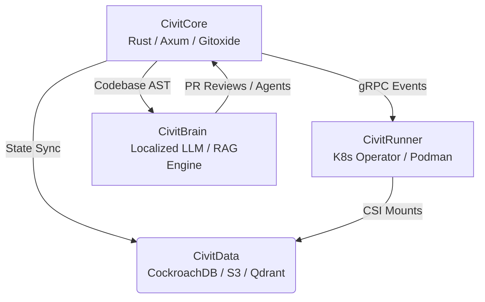

# CivitForge

**Federated, Rust-native engineering platform for extreme-scale monorepos.**

[](https://www.rust-lang.org)
[](https://www.gnu.org/licenses/agpl-3.0)
[](https://kubernetes.io)
[](https://podman.io)
[](CONTRIBUTING.md)

[Documentation](https://docs.civitforge.io) | [Architecture (TRD)](#architecture) | [Helm Charts](#deployment) | [Discord Community](https://discord.gg/civitforge)

---

## Overview

Standard Git forges lack the throughput, storage primitives, and security model required for terabyte-scale monorepos, gigabyte-scale ML assets, and zero-trust enterprise environments.

CivitForge is a software forge implemented in Rust that replaces centralized architectures with a federated multi-master mesh, replaces privileged container daemons with rootless Podman execution, and integrates an AST-aware, firewall-gated AI subsystem into the CI/CD pipeline.

Target domains: high-frequency trading, defense, ML research, and Tier-1 technology enterprises.

## Key Features

*   **Pure Rust core (`gitoxide`):** Parallelized Git operations with zero C bindings in critical paths (`#![forbid(unsafe_code)]`). Memory safety is guaranteed by construction.
*   **ForgeFed federation:** Geo-distributed multi-master replication. Commits target a local edge node and propagate globally via a custom DAG synchronization protocol, achieving eventual consistency without blocking the writer.
*   **Rootless CI/CD orchestration:** Kubernetes operator with Podman for daemonless, rootless container execution. User namespaces eliminate container-escape attack vectors.
*   **CivitBrain (air-gapped AI):** Embedded `vLLM` inference with AST-based codebase parsing (Tree-sitter) and RAG retrieval over a Rust-native vector database (Qdrant). No code leaves the perimeter.
*   **VFS and block-level LFS+:** Native virtual file system support (EdenFS/Scalar) for sub-second mounts of multi-terabyte working trees. FastCDC content-defined chunking replaces Git-LFS for deduplicated storage of large binary assets.
*   **SLSA Level 4 provenance:** Cryptographically signed runner images, automated SBOM generation (SPDX/CycloneDX), and hermetic build environments.

## Architecture

CivitForge partitions into four logical domains:



## Quick Start

### Local Development (Docker Compose)
Single-node, non-federated instance for testing:

```bash
git clone https://github.com/civitforge/civitforge.git
cd civitforge

docker-compose up -d

# UI available at http://localhost:3000
```

### Enterprise Deployment (Kubernetes)
Cloud-native deployment via Helm:

```bash
helm repo add civitforge https://charts.civitforge.io
helm repo update

helm install my-civitforge civitforge/civitforge \
  --namespace civitforge-system --create-namespace \
  --set federation.enabled=true \
  --set ai.vllm.enabled=true \
  --set runners.podman.rootless=true
```

See the [Deployment Guide](https://docs.civitforge.io/deployment) for CockroachDB replication and S3/MinIO backend configuration.

## Repository Structure

Cargo workspace containing the core components:

*   `/civit-core`: Axum HTTP/gRPC server, authentication layer, `gitoxide` Git engine.
*   `/civit-runner`: Kubernetes Operator and Podman sandbox execution engine.
*   `/civit-brain`: AI agent workflow engine, Tree-sitter AST parser, vector DB sync worker.
*   `/civit-vfs`: Rust FUSE daemon for local virtual file system mounting.
*   `/civit-crypto`: SBOM generation, Cosign integration, mTLS certificate management.

## Contributing

1.  Read the [Contribution Guidelines](CONTRIBUTING.md).
2.  Ensure all code passes `cargo clippy` and `cargo fmt`.
3.  `unsafe` blocks in `/civit-core` require explicit architectural committee approval.

## License

Dual-licensed:

*   **Open source:** GNU Affero General Public License v3.0 ([AGPLv3](LICENSE)).
*   **Enterprise:** CivitForge Commercial License (CCL) for proprietary integrations, closed-source modifications, or priority SLAs. [Contact Sales](mailto:enterprise@civitforge.io).

---
<div align="center">
  <i>"Structurally sound. Uncompromisingly secure."</i>
</div>
