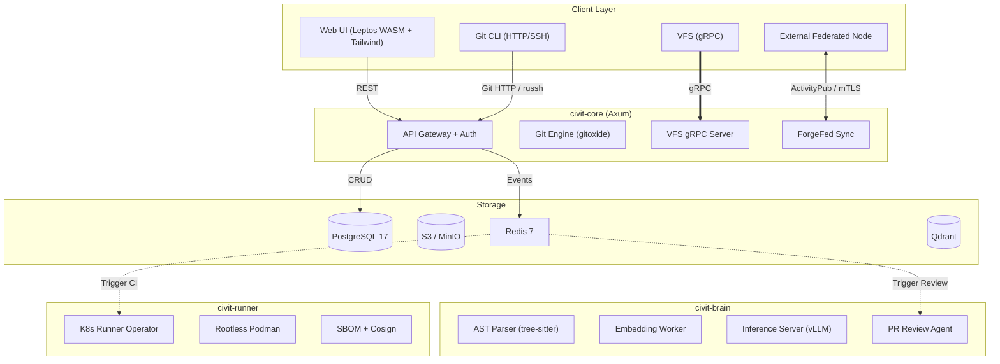

# CivitForge Architecture

See [docs/ARCHITECTURE.md](docs/ARCHITECTURE.md) for the canonical architecture documentation.

## System Overview

## Four Logical Domains

1. **CivitCore** -- HTTP/gRPC API, auth (JWT, RBAC, TOTP), gitoxide Git engine, SSH daemon, ForgeFed federation, events
2. **CivitRunner** -- CI/CD pipeline execution, K8s operator (kube-rs), rootless Podman sandbox, SLSA provenance
3. **CivitBrain** -- AST parsing (19 languages, 3-tier), RAG pipeline, vector DB (Qdrant), LLM inference
4. **CivitData** -- PostgreSQL 17 (relational), S3/MinIO (blob/LFS), Redis 7 (cache/pub-sub), Qdrant (vectors)
