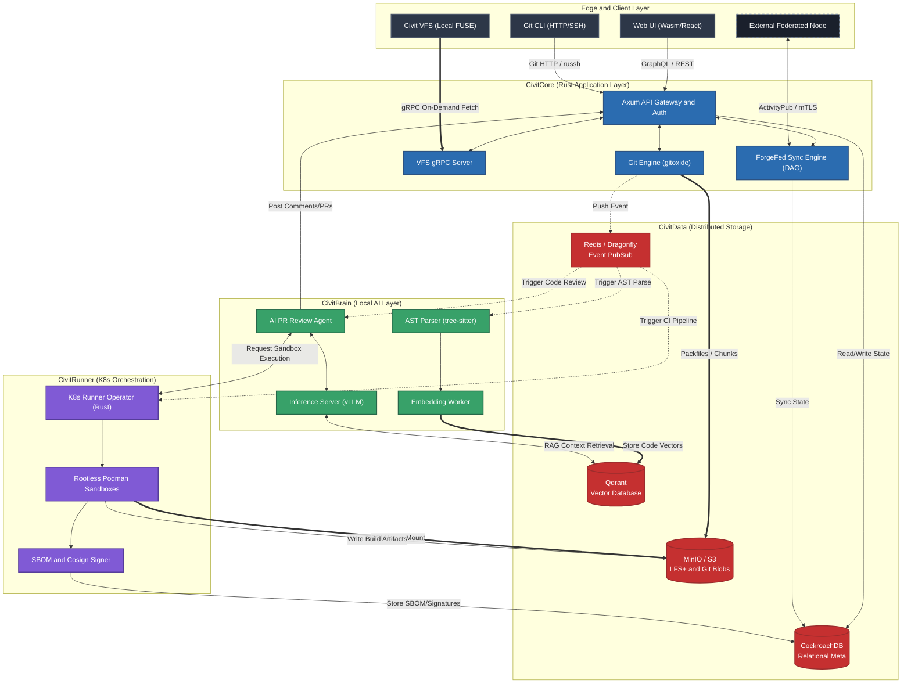

### The CivitForge Architecture Diagram

### Architecture Flow Description

The following describes the data flow through each subsystem during standard engineering workflows.

#### 1. Push to Monorepo

1.  A developer pushes via the Git CLI over SSH or HTTP.
2.  The request reaches the Axum API Gateway (CivitCore), which authenticates the caller via OIDC.
3.  The Git Engine (`gitoxide`) receives the payload and parallelizes object unpacking.
4.  Standard Git objects and deduplicated LFS+ chunks are streamed to S3/MinIO. Metadata (commit hashes, PR state transitions) is written to CockroachDB.
5.  On successful persistence, CivitCore emits a `CodePushed` event to Redis.

#### 2. AI RAG and Review (CivitBrain)

1.  Redis broadcasts the `CodePushed` event.
2.  The AST Parser consumes the event, fetches the diff, and decomposes the changed source into an abstract syntax tree via `tree-sitter`.
3.  The Embedding Worker segments the AST into semantic vectors and persists them in Qdrant.
4.  Concurrently, the AI PR Review Agent is triggered. It invokes `vLLM` to analyze the diff, querying Qdrant for repository-wide context (e.g., error-handling patterns, API contract conformance).
5.  The Agent posts its findings to the PR via the Core API.

#### 3. Secure CI/CD (CivitRunner)

1.  The K8s Operator consumes pipeline-trigger events from Redis.
2.  It schedules ephemeral Kubernetes Pods. CI tasks execute inside these pods via rootless Podman, using user namespaces to prevent container-escape attacks.
3.  When a pipeline requires large ML datasets, K8s CSI mounts the S3 buckets directly into the Podman container, bypassing network-based data transfer.
4.  On build completion, the Crypto Worker generates an SBOM, signs the image with Cosign/Sigstore, and pushes the signed artifact to S3.

#### 4. Federation

1.  When a PR is created, the ForgeFed Sync Engine checks whether the repository is shared with other geographic nodes (e.g., Tokyo, London) or external organizations.
2.  It propagates metadata and negotiates missing Git objects via an asynchronous DAG protocol over mTLS, achieving eventual consistency across all nodes without blocking the local writer.
